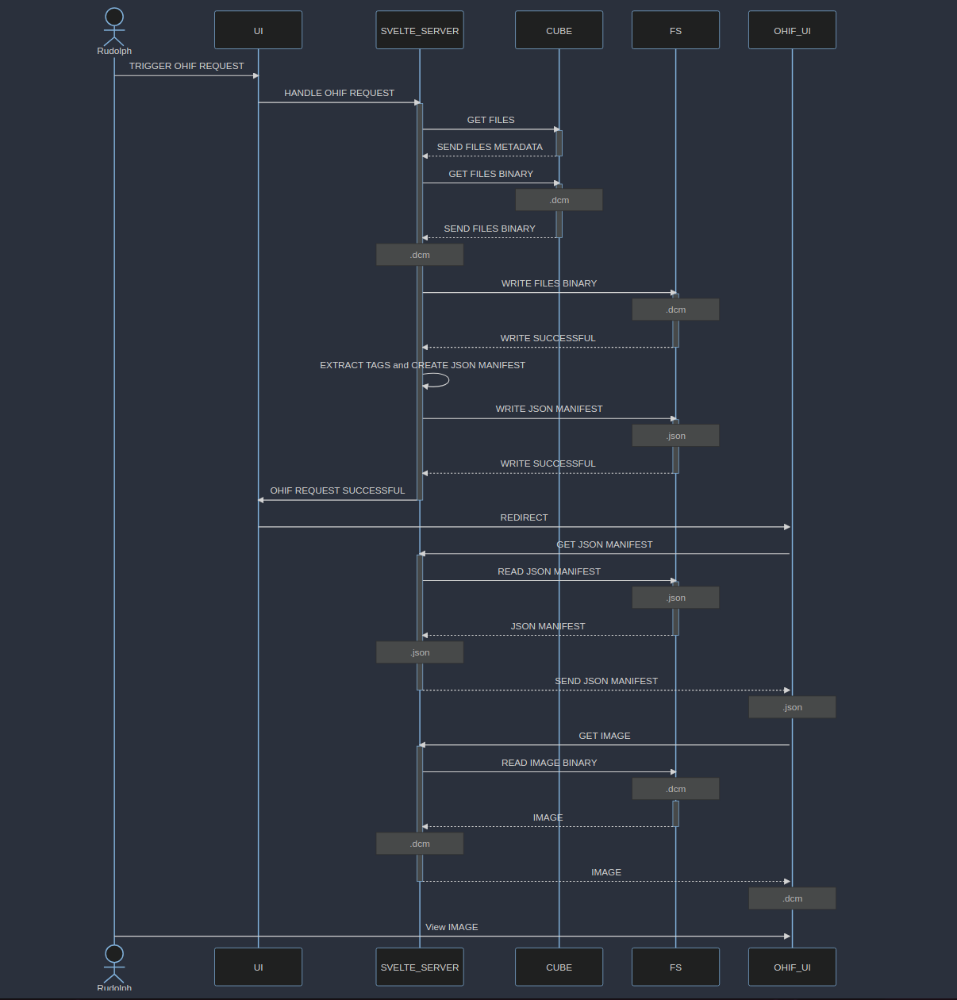
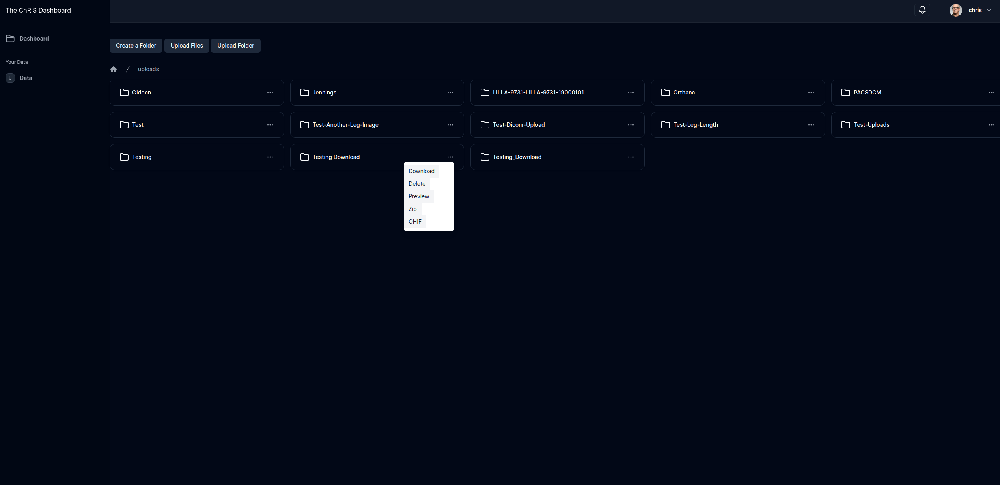
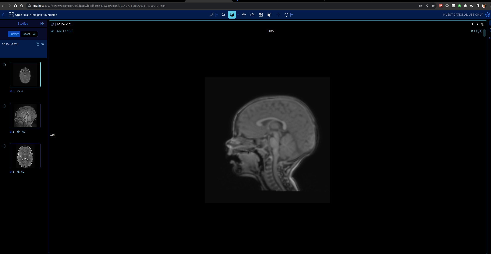

### Introduction

In our existing frontend application, React was utilized to create a Single Page Application (SPA), where pages were loaded and rendered exclusively in the browser. However, our more recent user interface (UI) has been developed using SvelteKit, which harnesses its Server-Side Rendering (SSR) capabilities.

Server-Side Rendering (SSR) is the process of rendering web pages on the server and subsequently transmitting the fully-rendered HTML to the client. In this approach, the server is responsible for generating the HTML, including any dynamic data, and it delivers the complete page to the client. Subsequently, the client displays the page without any further processing.

There are several advantages to shifting the rendering workload, traditionally handled by the browser, to the server. However, my primary motivation for this migration can be summarized through the following three key factors:

- Enhanced Performance: Server-side rendering leads to improved performance, as the HTML content is pre-generated and readily available for display when the page loads.

- Enhanced Compatibility: Server-side rendering results in heightened compatibility. Since the HTML is generated on the server, it is not reliant on the capabilities of the end-user's browser.

- Reduced Complexity: Server-side rendering reduces complexity in the development process. The server assumes the bulk of the responsibility for HTML generation, often leading to a simpler and more compact codebase.

### The Big Picture

The DICOM files that constitute our medical image dataset are centrally hosted on the server. This server acts as the primary repository for the digital medical images generated through various modalities. To initiate the OHIF Viewer and enable the retrieval of DICOM data, we configure the viewer with a specific route. This route is instrumental in establishing the context for data access and rendering within the OHIF UI.

Central to this integration is the use of a JSON (JavaScript Object Notation) file. This JSON file serves as a pivotal link between the OHIF Viewer and the DICOM data. Within the JSON file, we include references to the DICOM files stored on the server, in addition to comprehensive metadata that characterizes each image study.

JSON file stores the metadata for the study level, series level and instance level. A JSON launch file should follow the same structure as the one below.

```json
{
  "studies": [
    // first study metadata
    {
      "StudyInstanceUID": "1.3.6.1.4.1.14519.5.2.1.6279.6001.298806137288633453246975630178",
      "StudyDate": "20000101",
      "StudyTime": "",
      "PatientName": "",
      "PatientID": "LIDC-IDRI-0001",
      "AccessionNumber": "",
      "PatientAge": "",
      "PatientSex": "",
      "series": [
        // first series metadata
        {
          "SeriesInstanceUID": "1.3.6.1.4.1.14519.5.2.1.6279.6001.179049373636438705059720603192",
          "SeriesNumber": 3000566,
          "Modality": "CT",
          "SliceThickness": 2.5,
          "instances": [
            // first instance metadata
            {
              "metadata": {
                "Columns": 512,
                "Rows": 512,
                "InstanceNumber": 1,
                "SOPClassUID": "1.2.840.10008.5.1.4.1.1.2",
                "PhotometricInterpretation": "MONOCHROME2",
                "BitsAllocated": 16,
                "BitsStored": 16,
                "PixelRepresentation": 1,
                "SamplesPerPixel": 1,
                "PixelSpacing": [0.703125, 0.703125],
                "HighBit": 15,
                "ImageOrientationPatient": [1, 0, 0, 0, 1, 0],
                "ImagePositionPatient": [-166, -171.699997, -10],
                "FrameOfReferenceUID": "1.3.6.1.4.1.14519.5.2.1.6279.6001.229925374658226729607867499499",
                "ImageType": ["ORIGINAL", "PRIMARY", "AXIAL"],
                "Modality": "CT",
                "SOPInstanceUID": "1.3.6.1.4.1.14519.5.2.1.6279.6001.262721256650280657946440242654",
                "SeriesInstanceUID": "1.3.6.1.4.1.14519.5.2.1.6279.6001.179049373636438705059720603192",
                "StudyInstanceUID": "1.3.6.1.4.1.14519.5.2.1.6279.6001.298806137288633453246975630178",
                "WindowCenter": -600,
                "WindowWidth": 1600,
                "SeriesDate": "20000101"
              },
              "url": "dicomweb:https://ohif-dicom-json-example.s3.amazonaws.com/LIDC-IDRI-0001/01-01-2000-30178/3000566.000000-03192/1-001.dcm"
            },
            // second instance metadata
            {
              "metadata": {
                "Columns": 512,
                "Rows": 512,
                "InstanceNumber": 2,
                "SOPClassUID": "1.2.840.10008.5.1.4.1.1.2",
                "PhotometricInterpretation": "MONOCHROME2",
                "BitsAllocated": 16,
                "BitsStored": 16,
                "PixelRepresentation": 1,
                "SamplesPerPixel": 1,
                "PixelSpacing": [0.703125, 0.703125],
                "HighBit": 15,
                "ImageOrientationPatient": [1, 0, 0, 0, 1, 0],
                "ImagePositionPatient": [-166, -171.699997, -12.5],
                "FrameOfReferenceUID": "1.3.6.1.4.1.14519.5.2.1.6279.6001.229925374658226729607867499499",
                "ImageType": ["ORIGINAL", "PRIMARY", "AXIAL"],
                "Modality": "CT",
                "SOPInstanceUID": "1.3.6.1.4.1.14519.5.2.1.6279.6001.512235483218154065970649917292",
                "SeriesInstanceUID": "1.3.6.1.4.1.14519.5.2.1.6279.6001.179049373636438705059720603192",
                "StudyInstanceUID": "1.3.6.1.4.1.14519.5.2.1.6279.6001.298806137288633453246975630178",
                "WindowCenter": -600,
                "WindowWidth": 1600,
                "SeriesDate": "20000101"
              },
              "url": "dicomweb:https://ohif-dicom-json-example.s3.amazonaws.com/LIDC-IDRI-0001/01-01-2000-30178/3000566.000000-03192/1-002.dcm"
            }
            // ..... other instances metadata
          ]
        }
        // ... other series metadata
      ],
      "NumInstances": 133,
      "Modalities": "CT"
    }
    // second study metadata
  ]
}
```

As the OHIF Viewer is launched with the predefined route, it initiates an HTTP request to access the referenced JSON file. This request is executed with the intent of fetching critical metadata and establishing connections to the DICOM files residing on the server. Upon successful retrieval of the JSON file, the OHIF Viewer processes the embedded metadata. This metadata encompasses a wide range of information, including unique identifiers for studies and series, patient details, image acquisition parameters, and modality specifications.

With metadata in hand, the OHIF Viewer proceeds to establish connections and references to the individual DICOM files. These references typically take the form of URLs or file paths that pinpoint the precise location of each DICOM image within the server's storage.

### How does Svelte kit help ?

In the process of integrating OHIF (Open Health Imaging Foundation) with our custom server infrastructure, a significant challenge arises concerning authentication. More precisely, our custom server requires an authentication token to ensure secure access to DICOM (Digital Imaging and Communications in Medicine) files. However, OHIF autonomously initiates HTTP requests to retrieve the essential medical images, creating an inherent incompatibility with our authentication protocols.

To circumvent this authentication obstacle and ensure the secure delivery of DICOM files to the OHIF interface, we harness the capabilities of the Node.js server underpinning our Svelte Kit application. The Node.js server operates as a proxy, intercepting requests from OHIF directed towards our custom server.



Allow me to clarify some of the key entities depicted in the sequence diagram above:

- The User Interface (UI): This component of our Svelte application is responsible for handling user authentication via a dedicated login page. Additionally, it serves as an interface for accessing files stored on our custom server.

- User Interaction: A user initiates an OHIF request within this UI. A visual representation of this UI can be observed in the screenshot provided below.



- OHIF Request Processing: Upon initiating an OHIF request by clicking the designated menu button within the User Interface (UI), the UI triggers a request to the Svelte Server, which is implemented using Node.js, to oversee and manage this request. Subsequently, the Svelte Server establishes communication with our custom server to retrieve the necessary files. As part of its functionality, the Svelte Server also extracts relevant image tags from the retrieved files. Furthermore, it assembles a JSON manifest that adheres to the requirements specified by OHIF. The files themselves, along with the generated JSON manifest, are then stored on the local file system, utilizing Node.js's 'fs' module.

- UI Redirection: Following the successful extraction of image tags and the creation of the JSON manifest, the UI proceeds to initiate a redirection process. Specifically, it redirects to a predefined route within the OHIF viewer, which is configured to extract a URL parameter from the route itself. This URL parameter points to the location of the JSON manifest. Notably, this implies that the redirecting UI possesses knowledge of the public-facing IP address of the OHIF viewer. An illustrative example of such a URL parameter within the OHIF viewer route is as follows:

```
https://viewer.ohif.org/viewer/dicomjson?url=http://192.168.0.197/api/jsonfile/Testing.json

```

- OHIF Viewer Request: Subsequently, the OHIF viewer initiates a request to fetch the JSON manifest, as indicated by the URL provided in the 'url' parameter, which in this case is http://192.168.0.197/api/jsonfile/Testing.json. This request is directed towards an API route hosted on our Svelte Node.js server, which has been specifically configured to handle incoming GET requests to the `/api/jsonfile route`. The Svelte Node.js server interprets the incoming URL and serves the corresponding JSON manifest to OHIF.

- A pivotal element in the OHIF framework involves the retrieval of DICOM (Digital Imaging and Communications in Medicine) files, underpinned by reading of the metadata.

```json
{
  "studies": [
    // first study metadata
    //... study metadata
    {
      "series": [
        // first series metadata
        {
          "SeriesInstanceUID": "1.3.6.1.4.1.14519.5.2.1.6279.6001.179049373636438705059720603192",
          "SeriesNumber": 3000566,
          "Modality": "CT",
          "SliceThickness": 2.5,
          "instances": [
            // first instance metadata
            {
              "metadata": {
                //...image metadata
              },
              "url": "dicomweb:http://192.168.0.197/api/files/chris/uploads/Testing/0001-1.3.12.2.1107.5.2.32.35235.201112060752327594206283.dcm"
            }
            // ..... other instances metadata
          ]
        }
        // ... other series metadata
      ],
      "NumInstances": 133,
      "Modalities": "CT"
    }
    // second study metadata
  ]
}
```

- Of note is the 'url' attribute within this metadata structure, signifying the precise path to access the associated DICOM file. Within our workflow, the Svelte Server plays an instrumental role in facilitating this data retrieval operation. The server incorporates a dedicated API endpoint, accessible via /api/files/, diligently configured to ensure the delivery of DICOM files.




### Try this at home

**For the OHIF UI:**

1. Begin by cloning the OHIF UI repository to your local machine. You can do this with the following command:

```bash
git clone https://github.com/OHIF/Viewers
```

2. After cloning the repository, navigate to the repository's root directory and install the required dependencies by running:

```bash
yarn install && yarn run dev
```

This will make the OHIF viewer accessible at localhost:3000 or http://ip-address:3000. 

**For the Svelte App:**

1. Ensure that you have set up the ChRIS ULtron Backend by following the instructions provided in this documentation.

2. Clone the FNNDSC/chris_ui_ssr repository to your local machine using the following Git command:

```bash
git clone https://github.com/FNNDSC/chris_ui_ssr
```

3. Navigate to the root directory of the cloned repository and run the configure.sh script. 

```bash
./configure.sh
```

4. The configure.sh script will prompt you to configure certain settings. You have the option to manually set the IP address and ports, or you can simply press Enter to accept the default values. The default configuration will build the UI on your local IP address, using port 3001.

5. Once the Dockerfile is built, the UI will be accessible on port 3001 by default. To access it, open a web browser and go to the following address, replacing local-ip-address with your actual local IP address:

```bash
http://local-ip-address:3001
```

6. You can use the following login credentials to access the UI:

```md
Username: chris
Password: chris1234
```

7. Navigate to the "Data" folder within the UI and use the provided upload options to push files that you want to view. You can also perform various file operations by clicking on the ellipsis icon.


8. If you want to run the UI using NodeJS, In the root directory of the project, locate the .env file and edit it to specify the relevant endpoints. Below is an example of how the .env file should look:

```bash
# .env

# HTTP doesn't provide SvelteKit with a reliable way to determine the current requested URL. To inform SvelteKit about the app's serving location, set the ORIGIN environment variable:

ORIGIN='http://192.168.0.197:3000'

# Public API endpoints
PUBLIC_API_URL='http://192.168.0.197:8000/api/v1/'
PUBLIC_USERS_URL='http://192.168.0.197:8000/api/v1/users/'
PUBLIC_AUTH_URL='http://192.168.0.197:8000/api/v1/auth-token/'

# Example OHIF viewer URL
PUBLIC_OHIF_URL='https://viewer.ohif.org/'

```

Please note that 192.168.0.197 in the example represents my local IP address. Replace it with your own local IP address.

9. After configuring the .env file, run the following commands in the root directory of the project:

```bash
npm run build
node -r dotenv/config build
```

10. Once the application is built and running, you can access the UI by opening a web browser and navigating to the following address, replacing local-ip-address with your actual local IP address:

```bash
http://local-ip-address:3000
```


**References:**

1. [Vite Plugin SSR - SPA vs. SSR](https://vite-plugin-ssr.com/SPA-vs-SSR)

2. [GeeksforGeeks - Server-Side Rendering vs. Client-Side Rendering vs. Server-Side Generation](https://www.geeksforgeeks.org/server-side-rendering-vs-client-side-rendering-vs-server-side-generation/)

3. [OHIF Documentation - Dicom JSON Data Source](https://docs.ohif.org/configuration/datasources/dicom-json/)
