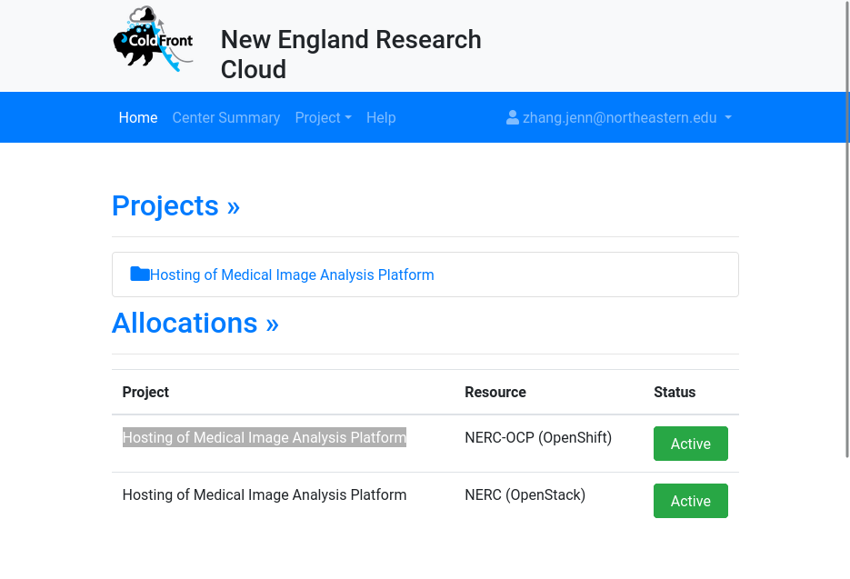
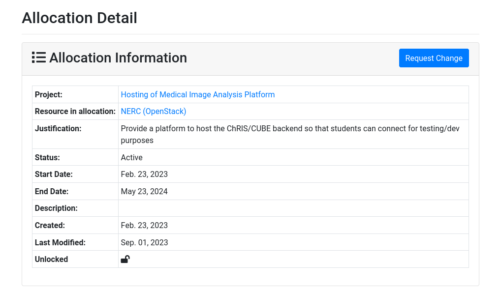
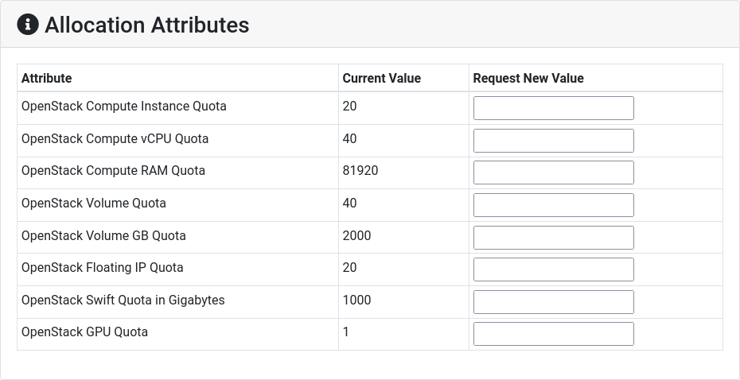
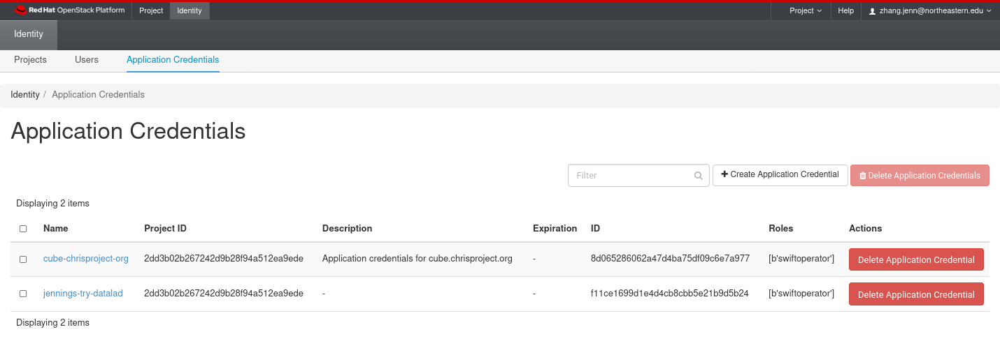
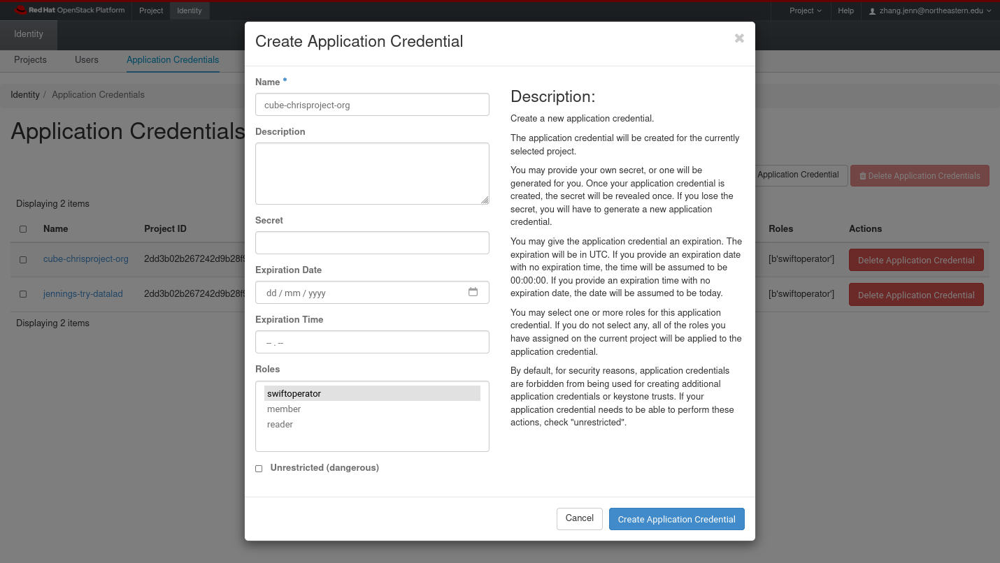

Currently, https://cube.chrisproject.org is being powered by a VM called `fnndsc.childrens.harvard.edu`
in the Boston Children Hospital network's DMZ. It's been working well for us through
the years, however its 480GB disk frequently runs out of space. For more
storage, we want to try migrating the data into [NERC](https://nerc.mghpcc.org) OpenStack Swift object storage.

<!--truncate-->

Ideally, we would rather use OpenShift NooBaa container object storage. Going 100% OpenShift is
still on our roadmap, but at this time the NERC OpenShift cluster is having problems. In the
meantime, we are going to use NERC OpenStack Swift instead.
See my other [blog post](../2023-09-02-swift-migration-to-openshift/index.md) about how the
OpenShift effort was going.

## Requesting a Quota on ColdFront

https://coldfront.mss.mghpcc.org/ is where we manage quotas and user access to our NERC projects.
We have one project called "Hosting of Medical Image Analysis Platform" and two allocations
for this project: one allocation on OpenShift and one for OpenStack.



Clicking into the OpenStack allocation, we can see our current quotas and request an increase.



The "Request Change" button brings us to a form where we can enter increased allocation values.
You must also provide a reason for the increased allocation.



I've done this twice, and NERC usually approves the request within 2 hours! :tada:

## Connecting to OpenStack

The web GUI for OpenStack is https://stack.nerc.mghpcc.org/.
To get CLI access, click on "Identity" -> "Application Credentials".



I created an application credential with the name `cube-chrisproject-org`
with the role `swiftoperator`.



After creating the application credentials, I clicked "Download openrc file"
to obtain the file called `app-cred-cube-chrisproject-org-openrc.sh` containing access tokens.

In the command line, I installed `python-swiftclient`

```shell
# on Arch Linux
sudo pacman -S python-swiftclient

# or, for any distro
pip install --user python-swiftclient
```

To translate the OpenStack "openrc" tokens to tokens Swift can use, run

```shell
source app-cred-cube-chrisproject-org-openrc.sh
swift auth
```

The output looks like

```
export OS_STORAGE_URL=https://stack.nerc.mghpcc.org:13808/v1/AUTH_XXXXXXXXXXXXXXXXXXXXXXXXXXXXXXXX
export OS_AUTH_TOKEN=XXXXXXXXXXXXXXXXXXXXXXXXXXXXXXXXXXXXXXXXXXXXXXXXXXXXXXXXXXXXXXXXXXXXXXXXXXXXXXXXXXXXXXXXXXXXXXXXXXXXXXXXXXXXXXXXXXXXXXXXXXXXXXXXXXXXXXXXXXXXXXXXXXXXXXXXXXXXXXXXXXXXXXXXXXXXXXXXXXXXXXXXXXXXXXXXXXXXXXXXXXXX
```

[The code for `ChRIS_ultron_backEnd`](https://github.com/FNNDSC/ChRIS_ultron_backEnd/blob/20d3eedf20610af9182f6cca8db8f0b3546b5336/chris_backend/core/storage/swiftmanager.py#L34
) uses [`swiftclient.Connection`](https://docs.openstack.org/python-swiftclient/2023.1/client-api.html)
which can be constructed using the values from the `swift auth` output.

TODO TODO TODO

```
$ rclone sync --progress swift:users nerc_swift:bchdmz_fnndsc_childrens_harvard_edu_docker_swift_onlyone_migrated
Transferred:      128.743 GiB / 128.743 GiB, 100%, 12.594 MiB/s, ETA 0s
Checks:             54945 / 54945, 100%
Transferred:       278086 / 278086, 100%
Elapsed time:   3h52m11.8s

$ echo $?
0

$ date
Sat 02 Sep 2023 09:39:43 PM EDT
```


```shell
openstack ec2 credentials list
```
