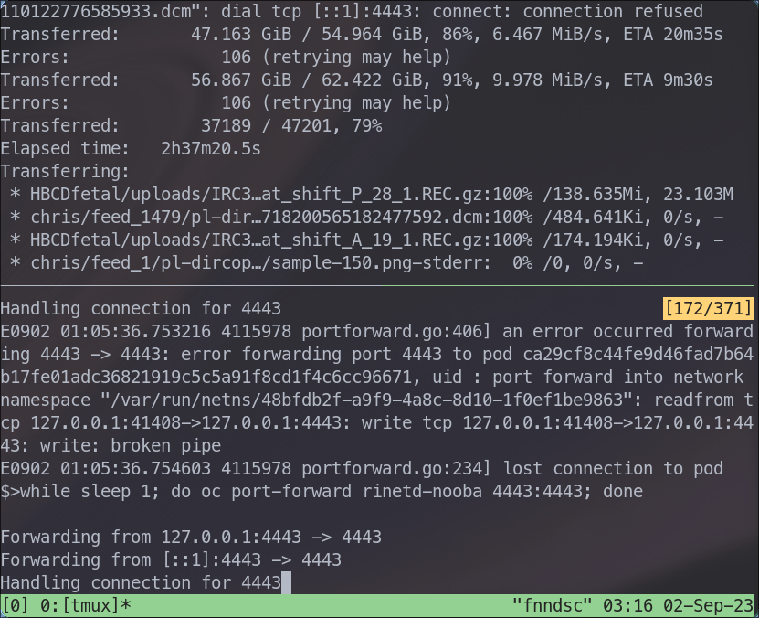

Currently, https://cube.chrisproject.org is being powered by a VM called `fnndsc.childrens.harvard.edu`
in the Boston Children Hospital network's DMZ. It's been working well for us through
the years, however its 480GB disk frequently runs out of space. For more
storage, easier deployments, and stability, we want to try migrating this instance
of the _ChRIS_ backend to the [NERC](https://nerc.mghpcc.org)'s OpenShift cluster.

<!--truncate-->

The data for CUBE are currently stored on the VM by an OpenStack Swift container using
[docker-swift-onlyone](https://github.com/FNNDSC/docker-swift-onlyone), which writes
to a local Docker volume. We need to move the data to an
[`ObjectBucketClaim`](https://access.redhat.com/documentation/en-us/red_hat_openshift_container_storage/4.6/html/managing_hybrid_and_multicloud_resources/object-bucket-claim)
in OpenShift.

## Other Options

It would've been easier to migrate data from the VM's Swift to NERC OpenStack Swift.
In the process of doing that, I realized that it wouldn't work without modifying CUBE's code.
CUBE only supports [Swift auth "v1"](https://docs.openstack.org/python-swiftclient/2023.1/swiftclient.html#module-swiftclient.authv1)
while NERC OpenStack must use "v3" given `storage_url` and `auth_token`.

To support `storage_url` and `auth_token` would take maybe 5 lines of code in CUBE.
But, would it be that much more effort to go the extra mile and implement S3 support in CUBE,
paving the way to a 100% OpenShift architecture? Well yes, 10,000% more effort, but whatever.

## Buckets in OpenShift

[NooBaa](https://www.noobaa.io/) gives OpenShift object storage.

```yaml
apiVersion: objectbucket.io/v1alpha1
kind: ObjectBucketClaim
metadata:
  name: cube-files
spec:
  generateBucketName: cube-files
  storageClassName: openshift-storage.noobaa.io
```

The `ObjectBucketClaim` creates a ConfigMap and Secret which detail how to connect to the bucket.

## Exposing the Bucket via `rinetd`

Now, the hard part: the bucket is only accessible from within OpenShift, and the Swift API is
only accessible from on the VM. How do we move data from the VM into OpenShift?

To make the bucket available to the VM:

1. Use [rinetd](https://github.com/samhocevar/rinetd) to make the bucket endpoint accessible from
   a pod in the OpenShift project namespace
2. `oc port-forward` to expose the pod container's port on the VM

The bucket endpoint `s3.openshift-storage.svc:443` comes from the ConfigMap `cube-files`.

```yaml
---
apiVersion: v1
kind: ConfigMap
metadata:
  name: rinetd-nooba
data:
  rinetd.conf: |-
    0.0.0.0 4443 s3.openshift-storage.svc 443

---
apiVersion: v1
kind: Pod
metadata:
  name: rinetd-nooba
  labels:
    app: rinetd-nooba
spec:
  containers:
    - name: rinetd
      image: docker.io/vimagick/rinetd@sha256:b13986b635ac909ae9aa6ef12972fd7071c91fe538e985b26eee77ad248a6158
      ports:
        - containerPort: 443
      volumeMounts:
        - name: config
          subPath: rinetd.conf
          mountPath: /etc/rinetd/rinetd.conf
  volumes:
    - name: config
      configMap:
        name: rinetd-nooba
```

## Rclone Configuration

`access_key_id` and `secret_access_key` come from the Secret `cube-files`.
The endpoint URL is `localhost:4443` because later we'll be reaching it using `oc port-forward`.

```ini title=~/.config/rclone/rclone.conf
[swift]
type = swift
auth_version = 1
key = testing
user = chris:chris1234
auth = http://localhost:52525/auth/v1.0

[fw-rinetd-nooba]
type = s3
provider = Other
access_key_id = XXXXXXXXXXXXXXXXXXXX
secret_access_key = XXXXXXXXXXXXXXXXXXXXXXXXXXXXXXXXXXXXXXXX
endpoint = localhost:4443
```

## Doing the Copy



In one `tmux` pane I'm running

```shell
while sleep 1; do oc port-forward rinetd-nooba 4443:4443; done
```

<details>
<summary>

The `while` loop is necessary because there are occasional errors (click to expand):

</summary>

```
E0902 01:05:36.753216 4115978 portforward.go:406] an error occurred forwarding 4443 -> 4443: error forwarding port 4443 to pod ca29cf8c44fe9d46fad7b64b17fe01adc36821919c5c5a91f8cd1f4c6cc96671, uid : port forward into network namespace "/var/run/netns/48bfdb2f-a9f9-4a8c-8d10-1f0ef1be9863": readfrom tcp 127.0.0.1:41408->127.0.0.1:4443: write tcp 127.0.0.1:41408->127.0.0.1:4443: write: broken pipe                                                     
E0902 01:05:36.754603 4115978 portforward.go:234] lost connection to pod
```

</details>

In another `tmux` pane, I have

```shell
until rclone sync --progress --no-check-certificate swift:users fw-rinetd-nooba:cube-files-938a843c-3bef-4724-90d5-4e85ac3e30c4; do sleep 10; done
```

As aforementioned, the networking from this VM to the bucket endpoint inside OpenShift is fallible
so the `until` loop and `rclone sync` are used to retry until all data are copied and verified.

`cube-files-938a843c-3bef-4724-90d5-4e85ac3e30c4` is the auto-generated bucket name,
obtained from the ConfigMap `cube-files`.

:::note

`--no-check-certificates` is necessary because the bucket endpoint uses a self-signed certificate.

:::

It was working, until it wasn't. I eventually started receiving 500 errors

> InternalError: We encountered an internal error. Please try again.

This is a problem with the NERC and I'll have to wait to hear back from the help desk.
