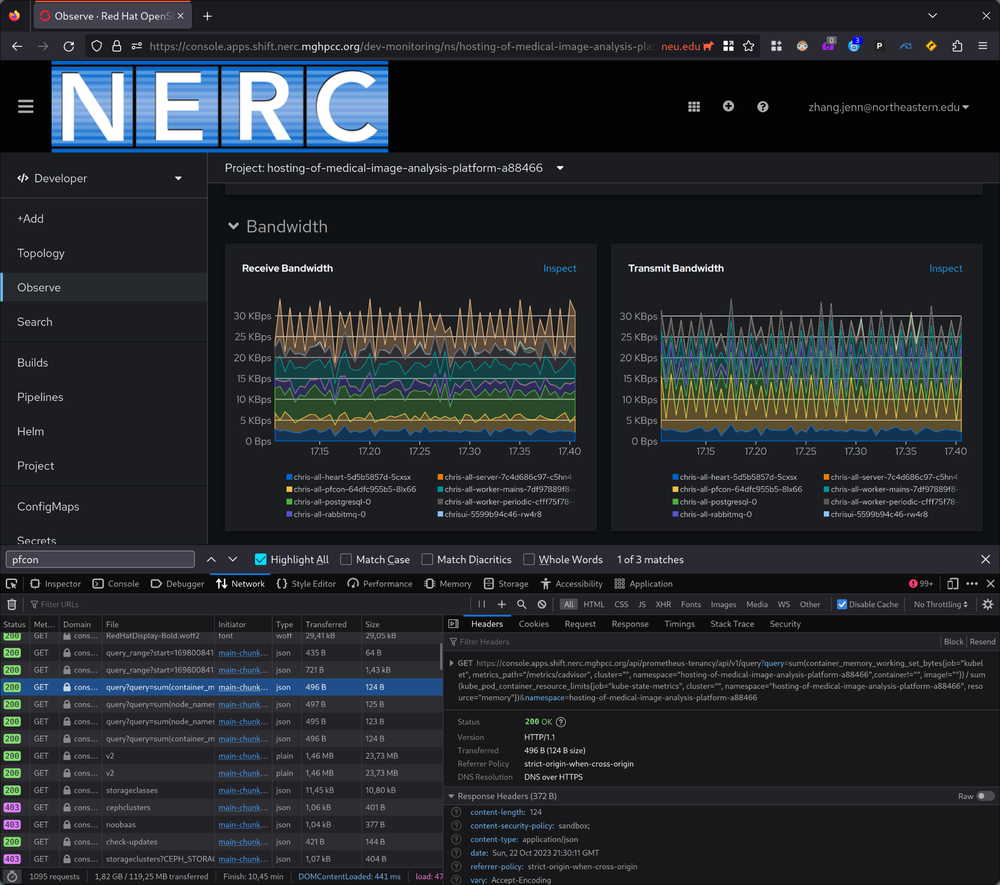

OpenShift provides some observability features out-of-the-box, but which features
are available depends on what your cluster admin has working and what you have access to.
On the NERC, we are able to see container metrics in OpenShift Developer's built-in
dashboard. To enable custom visualizations, metrics analysis, and alerting, we need to
connect this data to an instance of Grafana which we control.

<!--truncate-->

## Finding the Prometheus Endpoint



By pressing <kbd>f12</kbd> to open up Firefox's devtools we can see that the page is making
requests to the URL `https://console.apps.shift.nerc.mghpcc.org/api/prometheus-tenancy/api/v1/`,
and its API is the same as Prometheus' API. This looks like our way into OpenShift's internal
instance of Prometheus.

## Authentication with `prometheus-tenancy`

The tricky part is authentication. We need to create a token so that Grafana can make requests
to the Prometheus API. To obtain a token, we need to create a `ServiceAccount`, then we need to
give the `ServiceAccount` the relevant permissions via a `Role` and `RoleBinding` to be able
to access the Prometheus API.

```shell
oc create sa external-grafana
token="$(oc create token --duration=99999h external-grafana)"
```

I got an example request by copying a query from devtools with the option "Copy as cURL".
This gives me a command which I can use to test whether my token can authenticate with
Prometheus.


The `curl` command I copied is pasted below, with unnecessary `-H` options deleted.
I also added `-i`, which tells `curl` to print the response headers.

```shell
curl -i 'https://console.apps.shift.nerc.mghpcc.org/api/prometheus-tenancy/api/v1/query?query=sum%28container_memory_working_set_bytes%7Bjob%3D%22kubelet%22%2C+metrics_path%3D%22%2Fmetrics%2Fcadvisor%22%2C+cluster%3D%22%22%2C+namespace%3D%22hosting-of-medical-image-analysis-platform-a88466%22%2Ccontainer%21%3D%22%22%2C+image%21%3D%22%22%7D%29+%2F+sum%28kube_pod_container_resource_limits%7Bjob%3D%22kube-state-metrics%22%2C+cluster%3D%22%22%2C+namespace%3D%22hosting-of-medical-image-analysis-platform-a88466%22%2C+resource%3D%22memory%22%7D%29&namespace=hosting-of-medical-image-analysis-platform-a88466' \
  -H 'Accept: application/json' \
  -H 'Pragma: no-cache' -H 'Cache-Control: no-cache' \
  -H 'Cookie: openshift-session-token=sha256~XXXXXXXX; csrf-token=YYYYYYYY; ZZZZ=AAAA'
```

It returns something like:

```json
{"status":"success","data":{"resultType":"vector","result":[{"metric":{},"value":[1698013210.062,"0.07837875246062992"]}]}}
```

So it works! It also works if I delete the `csrf-token` cookie and everything which follows <span>&mdash;</span>
these values are not being checked.

Our next question is: how do we use the service account token instead of my browser session cookie
(which contains my user account oauth API token)? My instinct was to try `-H "Authorization: Bearer $token"`,
however it did not work. Passing my oauth API token in using the `Authorization` header did not work either.
Through trial and error, I found out that the `/api/prometheus-tenancy` endpoint authenticates using the `Cookie`
header only.

```shell
curl -i 'https://console.apps.shift.nerc.mghpcc.org/api/prometheus-tenancy/api/v1/query?query=sum%28container_memory_working_set_bytes%7Bjob%3D%22kubelet%22%2C+metrics_path%3D%22%2Fmetrics%2Fcadvisor%22%2C+cluster%3D%22%22%2C+namespace%3D%22hosting-of-medical-image-analysis-platform-a88466%22%2Ccontainer%21%3D%22%22%2C+image%21%3D%22%22%7D%29+%2F+sum%28kube_pod_container_resource_limits%7Bjob%3D%22kube-state-metrics%22%2C+cluster%3D%22%22%2C+namespace%3D%22hosting-of-medical-image-analysis-platform-a88466%22%2C+resource%3D%22memory%22%7D%29&namespace=hosting-of-medical-image-analysis-platform-a88466' \
  -H 'Accept: application/json' \
  -H 'Pragma: no-cache' -H 'Cache-Control: no-cache' \
  -H "Cookie: openshift-session-token=$token"
```

We get a different error message:

```
Forbidden (user=system:serviceaccount:hosting-of-medical-image-analysis-platform-a88466:external-grafana, verb=get, resource=pods, subresource=)
```

This is progress, and fortunately the response tells us exactly what we need. The `external-grafana`
service account needs permission to the `pods` resource using the `get` verb. Let's fix that by
creating a `Role` and `RoleBinding`. Just for good measure, we can give the `Role` all read-only
verbs `get`, `list`, and `watch`.

```yaml
apiVersion: rbac.authorization.k8s.io/v1
kind: Role
metadata:
  name: prometheus-tenancy-reader
rules:
- apiGroups: [""]
  resources: ["pods"]
  verbs: ["get", "list", "watch"]

---

apiVersion: rbac.authorization.k8s.io/v1
kind: RoleBinding
metadata:
  name: grafana-external-may-read-prometheus-tenancy
roleRef:
  apiGroup: rbac.authorization.k8s.io
  kind: Role
  name: prometheus-tenancy-reader
subjects:
- kind: ServiceAccount
  name: external-grafana
```

Once I `oc apply`-ed the `Role` and `RoleBinding`, the `curl` using the service account's `$token` worked!

## Configuring Grafana

Finally, onto configuring Grafana:

- The URL to use is `https://console.apps.shift.nerc.mghpcc.org/api/prometheus-tenancy/?namespace=hosting-of-medical-image-analysis-platform-a88466`.
  It is important to include the query string `?namespace=...`.
- Authentication using the cookie is achieved by setting a "Custom HTTP Header" `Cookie` with the value `openshift-session-token=...`.
- "HTTP Method" must be set to "GET".
- "Custom query parameters" should be set to `namespace=...`
- Metrics lookup does not work ([see below](#why-cant-metrics-lookup-work)) so in the "Misc" section I toggled the switch for "Disable metrics lookup".


And... It works!


### Why Can't Metrics Lookup Work?

The `prometheus-tenancy` API exposes a subset of Prometheus' API, `query`, `query_range`, and `rules`
([code](https://github.com/openshift/console/blob/8bb3c6af9c31e199e0ffd52931384bc130ab92f1/pkg/server/server.go#L408-L411)).
Grafana requires the `labels` and `values` API endpoints for the metrics lookup feature.

In OpenShift's Observe UI, there is the option to run a Metrics "Custom query" which has a metrics name autocomplete feature.


How does it work? Going back to Firefox devtools, I exported all the HTTP requests by clicking "Save all as HAR".
A [HAR file](https://en.wikipedia.org/wiki/HAR_(file_format)) is just a JSON document containing all the request data.
I searched the HAR file for the string `container_sockets` because I knew this string would appear in the response
to the request which fetches the list of metric names to use for the autocomplete feature. It turns out the request
is being made to `/prometheus-tenancy/api/v1/query` with the PromQL query

```promql
count({namespace="hosting-of-medical-image-analysis-platform-a88466"}) by (__name__)
```

I confirmed that this query is used for the feature by finding the responsible code in the source repository
for the OpenShift console
([code](https://github.com/openshift/console/blob/8bb3c6af9c31e199e0ffd52931384bc130ab92f1/frontend/packages/dev-console/src/components/monitoring/metrics/MetricsQueryInput.tsx#L93)).

For convenience, I saved the names from the query result to a text file which you can download:
[openshift_prometheus_tenancy_metric_names.txt](/res/openshift_prometheus_tenancy_metric_names.txt)
