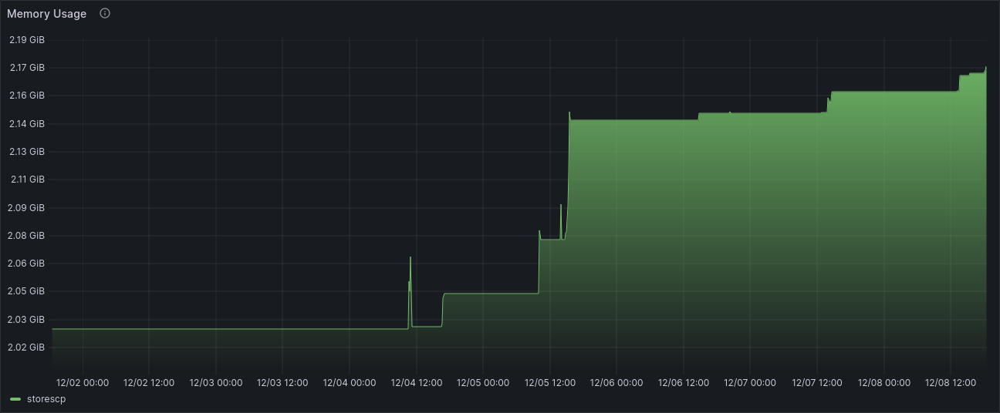
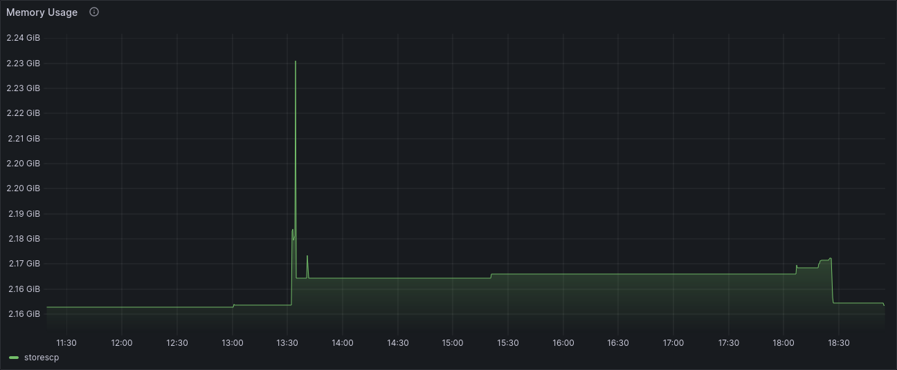

**tl;dr** the container filesystem lives in-memory, so temporary files and directories
which don't get deleted will eat up RAM.



<!--truncate-->

Grafana reports the "working set bytes" a.k.a. memory usage of some of our services to
be creeping up over time, heading to the range of gigabytes. Well that's not good.
At first, I believed this to be an error with my PromQL: could the graph
be showing me the wrong data? However, the graphs looked reasonable for our
stateless apps and the Kubernetes system pods. So I dug deeper.

In this specific pod, only one process is running. The process is a C program
using only 47MB of memory when idle. Yet, the container was using 2.17GB of memory.
What accounts for the extra memory?

I had an idea: in the container's `/tmp`, there were many stale cache directories.
I ran a command to clean up all directories older than 15 days:

```shell
find -type d -maxdepth 1 -mtime +15 -exec rm -rv '{}' \;
```

Viola! That helped bring down the memory usage to a previous baseline.



But it's still consuming 2.16GB, which I assume is some other overhead from the container runtime.
I don't really know!
