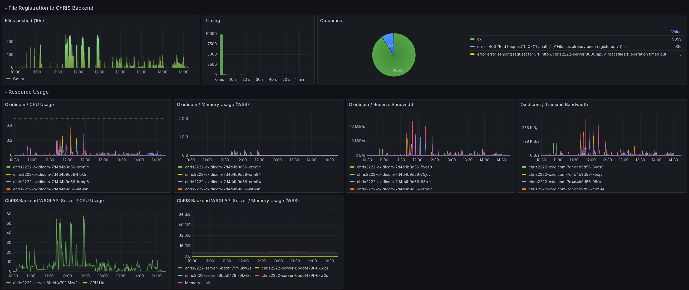

- How _oxidicom_ works and the design decisions we've made
- Our choice of observability stack
- The challenges of getting started with observability

<!--truncate-->

## Observability

_oxidicom_ is instrumented to send traces in the OpenTelemetry format. Traces can be easily interpreted as either
logs and/or metrics. The OpenTelemetry format is vendor-neutral, allowing us to try out various observability
backends and swap components in and out with ease. We have evaluated several backends:

| Name                    | Website                                                                                                          | Role                  | Pros                                                                                                                                                                      | Cons                                                                                                                    |
|-------------------------|------------------------------------------------------------------------------------------------------------------|-----------------------|---------------------------------------------------------------------------------------------------------------------------------------------------------------------------|-------------------------------------------------------------------------------------------------------------------------|
| OpenObserve             | https://openobserve.ai/                                                                                          | Storge, visualization | Easiest to set up and cheapest to run.                                                                                                                                    | User interface is less capable than Grafana. Desirable features such as SSO and Grafana intergration are paid features. |
| Grafana                 | https://grafana.com/oss/grafana/                                                                                 | Visualiation          | Featureful UI and a lot of community content.                                                                                                                             | Reshaping data using the data transformations is annoying to figure out.                                                |
| Vector                  | https://vector.dev/                                                                                              | Collector             | Resource efficient and easy to configure.                                                                                                                                 | No support for tracing.                                                                                                 |
| OpenTelemetry Collector | https://opentelemetry.io/docs/collector/                                                                         | Collector             | Many features and wide vendor support                                                                                                                                     | Difficult for newcomers to grasp basic concepts (due to its single-purpose and vendor-neutral design).                  | 
| Tempo                   | https://grafana.com/oss/tempo/                                                                                   | Storage               | Out-of-the-box integration with Grafana                                                                                                                                   | None                                                                                                                    |
| Loki                    | https://grafana.com/oss/loki/                                                                                    | Storage               | Out-of-the-box integration with Grafana                                                                                                                                   | None                                                                                                                    |
| Quickwit                | https://quickwit.io/                                                                                             | Storage               | Supports logging and traces. High performance. Compatible with Jaeger and Grafana. Its plugin for Grafana makes it easy to transform traces to logs or traces to metrics. | Documentation is good, but not comprehensive.                                                                           |
| kube-prometheus-stack   | https://github.com/prometheus-community/helm-charts/tree/main/charts/kube-prometheus-stack#kube-prometheus-stack | Storage               | All-in-one setup                                                                                                                                                          | Configuration file is more than 4,000 lines long...                                                                     |

On our private Kubernetes cluster, we use a mix of kube-prometheus-stack (which includes Grafana), Vector (for logs), Loki (for logs), OpenTelemetry Collector (for traces), and Quickwit (for traces).

Our public deployments on the NERC are smaller and also monetary cost is a concern. There we use OpenObserve paired with OpenTelemetry Collector (via the Red Hat OpenTelemetry Operator), along with OpenShift's built-in observability features.

## Performance Dashboards

## Challenges

### What to observe, what to discard?

### What Observability Backend to Choose?

kube-prometheus-stack includes Thanos for Prometheus long-term storage. In the future, I would be curious to try alternatives such as [Grafana Mimir](https://grafana.com/oss/mimir/) or
[GrepTimeDB](https://github.com/GreptimeTeam/greptimedb).
