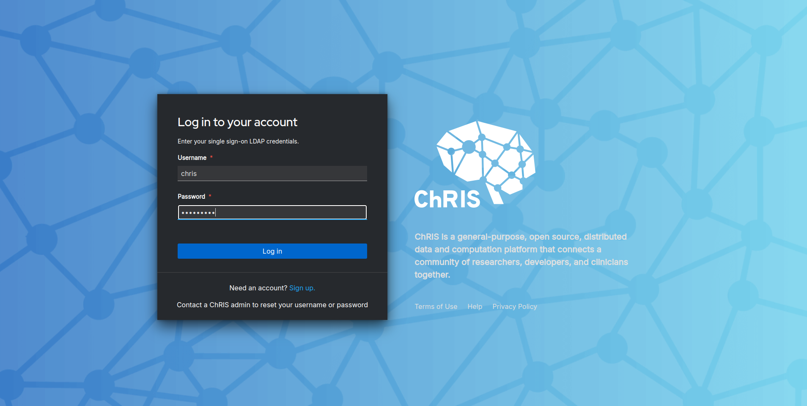
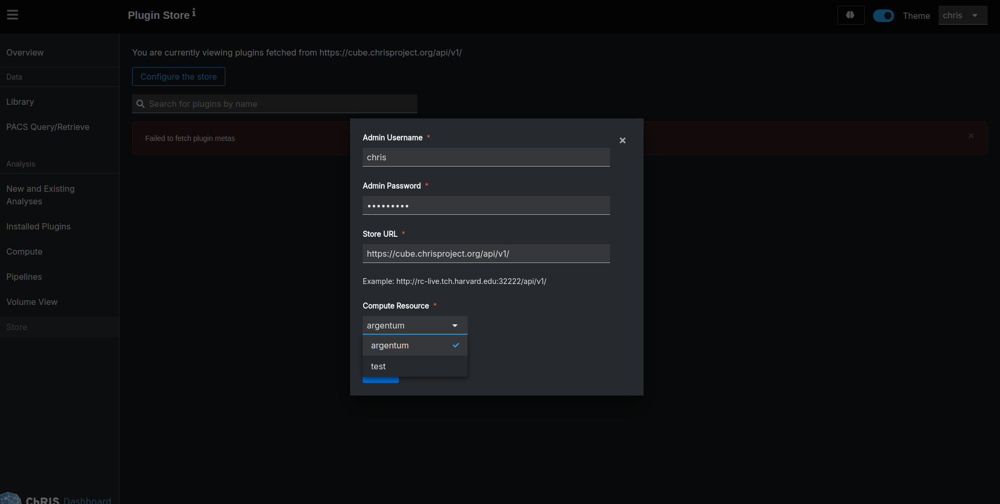
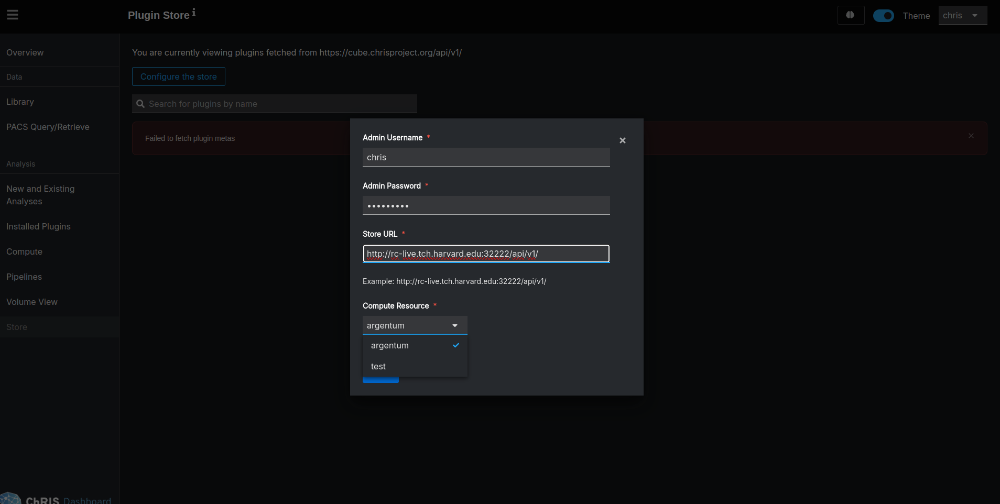
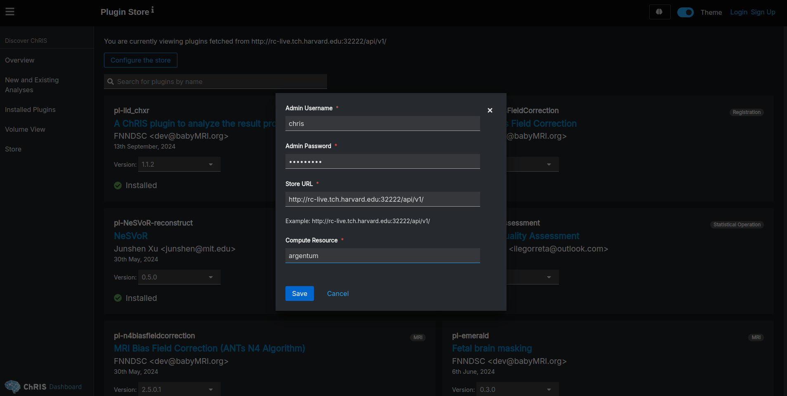
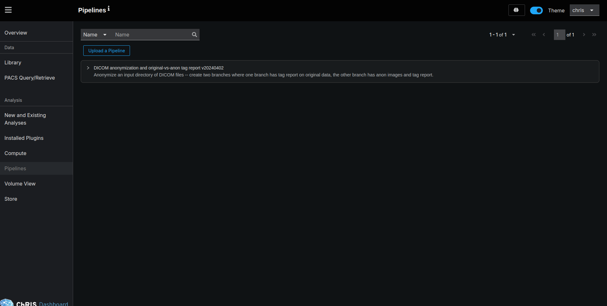

When you install ChRIS using miniChRIS Docker, you might need additional plugins on your machine. This guide explains how to install plugins from the ChRIS Store into your local ChRIS instance. We'll cover the steps to configure and use the ChRIS Store, both when logged in as a staff user and when not logged in.

By default, the local UI points to https://cube.chrisproject.org/api/v1/, which acts as a central repository for installing plugins on your local cube. The goal is straightforward: you need plugins on your local UI, and you can install them from the store. Currently, https://cube.chrisproject.org requires CORS settings configuration, but if you're on an internal network, you can point the UI to a different store.

There are two modes to configure the UI:

1. Logged in as a admin user
2. Not logged in or non-admin user
If you've set up the UI and backend using miniChRIS Docker, the admin username is chris and the password is chris1234. Let's start with the workflow for a logged-in user.

### Workflow for Logged-In Admin Users

1 Log in.

Once logged in, click on the Configure the Store button.

2. Configure the Store Settings.

You'll see some pre-filled values. If you're on the internal network, point your UI to the internal store example. Since you're already authenticated as an admin user, you don't need to configure the admin username and password for the chris-admin website. You can keep it as the default.

3. Save and Install Plugins.

After clicking Save, your UI should populate with all the available plugins. Click Install on any plugin to install it.

[store](./store.png)

### Configurations for Non-Staff or Not Logged-In Users

If you're not logged in, you'll need to provide the username and password for the chris-admin website in the configuration form. For a local setup, use chris for the username and chris1234 for the password. Additionally, ensure the compute resource input box is correctly set. In this example, the compute resource is named argentum. Click Save to install plugins without logging in.

This configuration also applies to non-admin users.

### Uploading Pipeline Source Files
With the store correctly set and plugins installed, you can upload pipeline source files in .json and .yml formats. The UI will automatically upload any missing plugins required for the pipeline, regardless of whether you're an admin or non-admin user.

