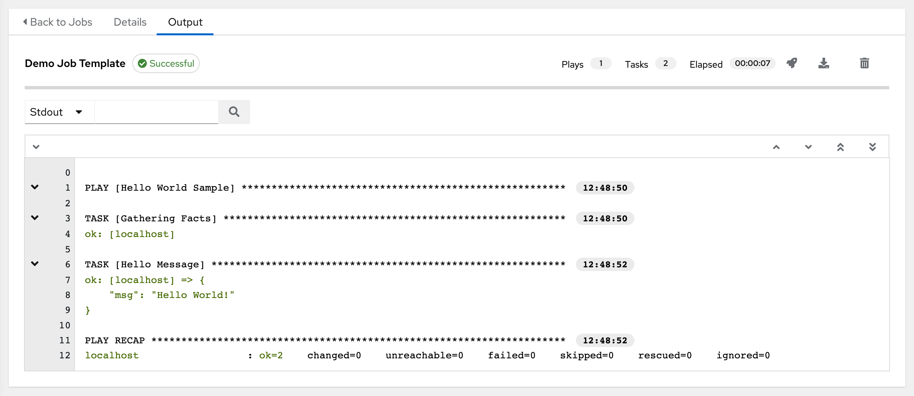

[Ansible](https://docs.ansible.com/ansible/latest/getting_started/introduction.html)
is very confusing to learn for the first time because of its jargon. What is
the difference between plays, roles, and tasks? This blog attempts to answer
this question using analogies to programming concepts.

<!-- truncate -->

<details>
<summary>
The writing style here aims to be blunt, opinionated, and over-simplified&hellip;
</summary>

In casual words, _"Ima keep it real with you chief."_ You are probably curious
about Ansible because you want to save yourself time. If that does not describe
you, go read the official documentation or take a full-fledged Ansible course.
Links to those can be found on the
[awesome-ansible](https://github.com/ansible-community/awesome-ansible) list.

</details>

<details>
<summary>
What does the official documentation say?
</summary>

https://docs.ansible.com/ansible/latest/getting_started/basic_concepts.html

> **Playbooks**: They contain Plays (which are the basic unit of Ansible
> execution) \[...\]
>
> **Plays**: The main context for Ansible execution, this playbook object maps
> managed nodes (hosts) to tasks. The Play contains variables, roles and an
> ordered lists of tasks \[[...\]
>
> **Roles**: A limited distribution of reusable Ansible content (tasks,
> handlers, variables, plugins, templates and files) \[...\]
>
> **Tasks**: The definition of an ‘action’ to be applied to the managed host
> \[...\]

Reading this myself, I was confused. What is a "unit of Ansible execution" v.s.
"content for Ansible execution" v.s. "definition of an 'action'"?

</details>

## What is Ansible?

Suppose you are trying to manage a large number of computers. You might have
a setup script which you copy to each machine and run via `ssh`.

Running scripts over SSH is essentially what Ansible does. Ansible provides a
framework so that those scripts are standardized and somewhat easier to read.

## A Play is a "Main" Function

An Ansible **Playbook** is a file which contains a **play**. A play is akin to
a main function, e.g. `fn main()` (Rust),
`public static void main(String[] args)` (Java), etc.

## Roles are Functions

Ansible **Roles** are like functions: e.g. you might have a shell function

```python

PARENT_DIR=/etc/foobar               # global constant

create_config_folder() {             # function name
  local my_folder="$1"               # define parameter
  mkdir -p "$PARENT_DIR/$my_folder"  # do the behavior
}
```

Ansible roles define their constants in `vars/main.yml`, parameters in
`defaults/main.yml`, and behavior in `tasks/main.yml`.

```yaml
# roles/create_config_folder/vars/main.yml
---
parent_dir: /etc/foobar

# roles/create_config_folder/defaults/main.yml
---
my_folder: ""

# roles/create_config_folder/tasks/main.yml
---
- name: Create the configuration folder
  ansible.builtins.file:
    path: "{{ parent_dir }}/{{ my_folder }}"
    state: directory
```

Use roles by specifying them in a playbook:

```yaml
# my_playbook.yml
---
- hosts: webservers
  roles:
    - create_config_folder
```

Variables are set in your inventory. For example, the equivalent to running
the shell function `create_config_folder` with the parameter `conf.d` would be:

```yaml
# inventory/hosts.yml
webservers:
  hosts:
    server-1:
      my_folder: conf.d
```

## Tasks are Statements, List of Tasks are Closures

Thankfully, **Ansible Tasks** are pretty intuitive. The above example contained
one task in the file `tasks/main.yml`:

```yaml
---
- name: Create the configuration folder
  ansible.builtins.file:
    path: "{{ parent_dir }}/{{ my_folder }}"
    state: directory
```

You can create separate files containing lists of tasks, and invoke them using
`ansible.builtin.include_tasks`:

```yaml
# roles/create_config_folder/defaults/other.yml
---
- name: Create the configuration folder
  ansible.builtins.file:
    path: "{{ parent_dir }}/{{ my_folder }}"
    state: directory

- name: Ensure the file 'example.txt' exists in the configuration folder
  ansible.builtins.file:
    path: "{{ parent_dir }}/{{ my_folder }}/example.txt"
    state: touch

# roles/create_config_folder/defaults/main.yml
---
- name: Example of how to invoke a list of tasks
  ansible.builtins.include_tasks:
    file: other.yml
```

## Best Practice: Use Roles

I suggest some best practices for beginners to follow:

- Playbooks should only contain a list of roles.
- Define a role for everything you want to do.
- The `tasks/main.yml` file of a role _should_ be short, e.g. \<100 lines.
  It _should_ describe _business logic_. Put implementation details in other
  files `tasks/*.yml` and call them from `tasks/main.yml`.

For example, at the FNNDSC we maintain a computer lab of Linux workstations.
Each Linux workstation must (1) comply with hospital IT security(-theater),
(2) LDAP login, and (3) access our research NFS. Our playbook looks like:

```yaml
---
- name: Provision workstation computer
  hosts: workstations
  become: true
  roles:
    - role: use_http_proxy
      tags: [it, http_proxy]
    - role: install_antivirus
      tags: [it, antivirus]
    - role: login_over_ldap
      tags: ldap
    - role: mount_research_nfs
      tags: nfs
```

- Ideally, write your roles such that order does not matter. In the example
  above, `use_http_proxy` _must_ run first, but the order of everything else
  does not matter.
- Tasks _can_ be defined in a play directly, which is depicted commonly in the
  official documentation. In practice, having tasks in a playbook should be
  done sparingly because it is not composable.

## Opinionated Reality-Check

Ansible is great because of how so many people use and contribute to it.
However, Ansible is old&mdash;it was first released in 2012 and written in
Python 2. This is immediately apparent in how it is slow and its error messages
are usually hard-to-read. Furthermore, its own claims to fame are stretched
truths:

- Ansible claims to encourage _readable_ code which is somewhat true, but only
  because its syntax is wordy.
- Ansible boasts about being _declarative_, but in reality it's three
  _imperative_ scripts in a trench coat. This is no secret: tasks are defined
  as a YAML list (i.e. a sequence of instructions). Roles are also executed
  sequentially in an order-dependent fashion.

Nonetheless, I do recommend Ansible. It's 10x better than Bash scripting,
and at the end of the day, some standardization is better than none.

## P.S.: AWX is the Ansible UI



Red Hat doesn't want you to know that [AWX](https://github.com/ansible/awx)
is the free and open-source upstream to their paid product "Red Hat Ansible
Automation Platform." This is not a secret, but it took me 30 minutes to find
out.

https://ansible.readthedocs.io/projects/awx/en/24.6.1/index.html

