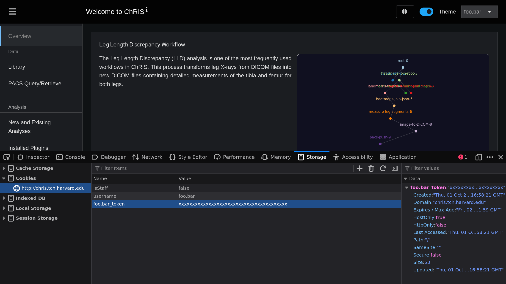

# Hacks

Here are some useful hacks for dealing with common _ChRIS_ problems.
These violate best practices. You didn't hear it from me!

## Impersonating a User

Suppose you want to troubleshoot an account-specific problem for a _ChRIS_ user,
without having to ask for their password. You can obtain an authorization token
for a given username from the Django admin shell. In a terminal, run

```shell
kubectl exec -it -n chris deploy/chris-server -- python manage.py shell
```

And execute the Python code:

```python
user = User.objects.get(username='foo.bar')
Token.objects.get_or_create(user=user)
```

The console will print out a token which you can copy-paste and use to
authenticate with [_CUBE_](/docs/glossary#CUBE).

Furthermore, you can edit the cookies in _ChRIS\_ui_ to impersonate the user.
Open devtools (press <kbd>F12</kbd>). There are two cookies to edit:

- Edit the key and value of `{username}_token`
- Edit the value for `username`



After editing the cookies, refresh the page (press <kbd>F5</kbd>). You should
now be logged in as the target user.

## Modifying Read-Only Plugin Properties

OOMKilled is a frustrating problem in _ChRIS_. Setting `memory_limit` for plugin
instances can be tedious, furthermore it can't even be set for plugin instances
created by a workflow.

The proper way to fix these problems is to delete the plugin then re-upload it.
Alternatively, plugin properties can be modified in-place using the Django shell.

The `min_memory_limit` of a plugin can be increased using the Django shell.
First, open a Django Python shell, e.g.

```shell
kubectl exec -it -n chris deploy/chris-server -- python manage.py shell
```

Then find your plugin and customize it to your heart's content, though be mindful
of how modification can break things for your users, and can violate reproducibility.

```python
from plugins.models import Plugin
p = Plugin.objects.get(dock_image='fnndsc/pl-nii2mnc:1.1.0')
p.min_memory_limit = 2048
p.save()
```

