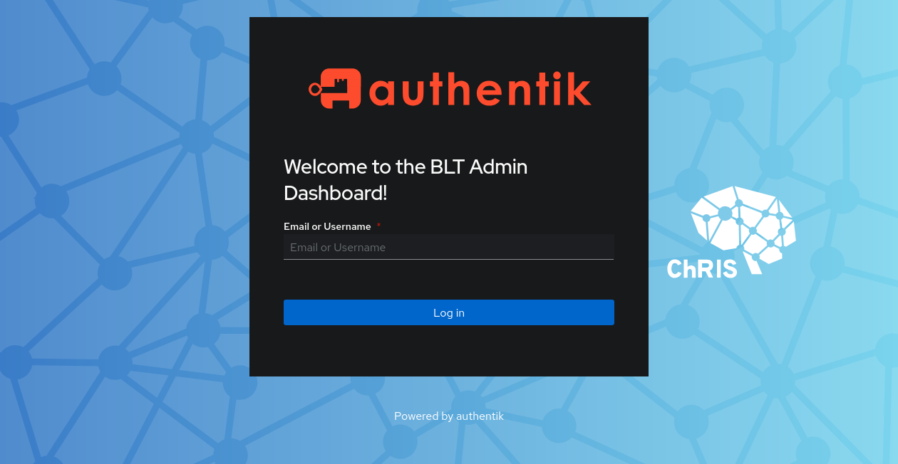
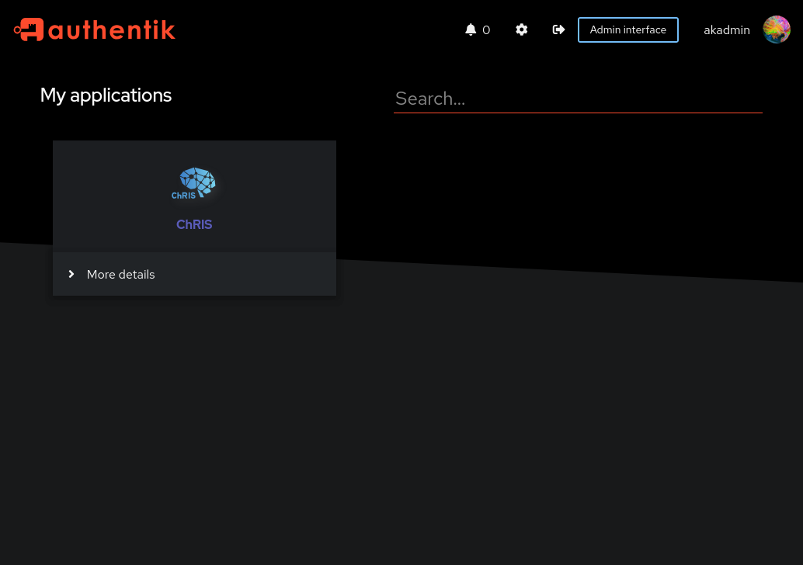
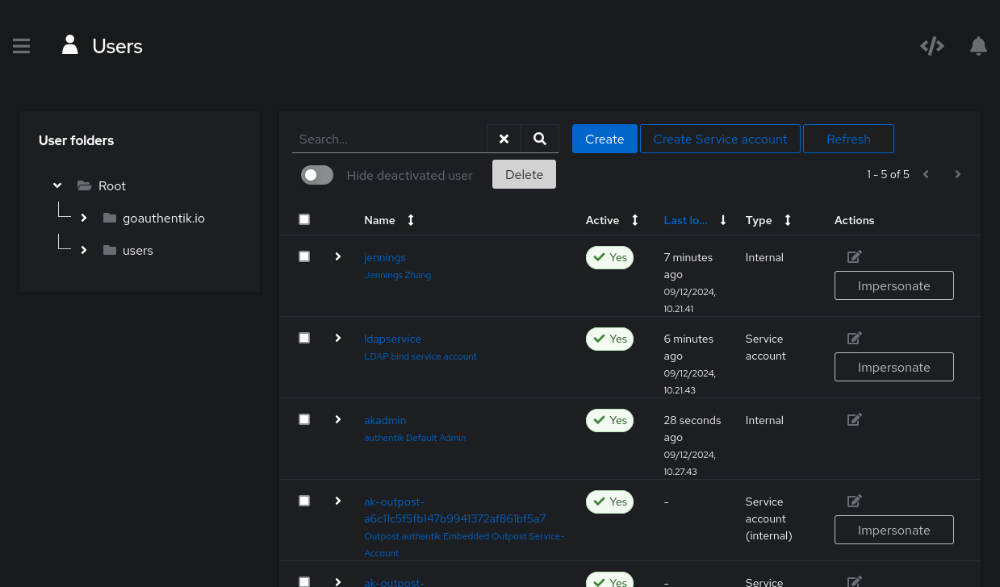
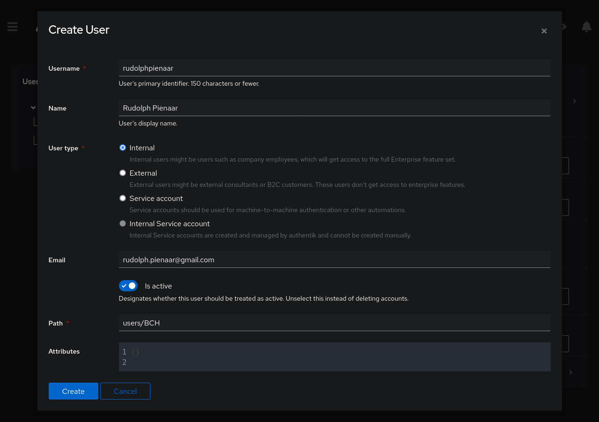
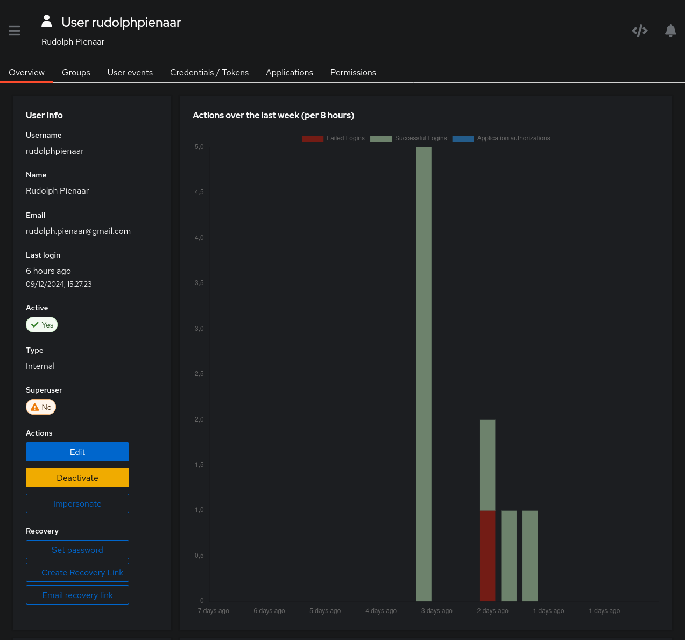

# User Management

This page describes how to invite people to access _ChRIS_ for the BLT collaboration (or to remove them).
You must have an admin account. Ask a member of the Boston Children's Hospital (BCH) team if you think
you should be granted admin privileges.

### 1. Login to the Admin Dashboard

https://auth.blt.chrisproject.org

### 2. Click "Admin interface" in the top-right corner.

### 3. Click on "Users" on the left drawer.

### 4. Click on the "Create" button and fill out the form.

### 5. Click on the created user, then click "Create Recovery Link".

:::warning

Do not click "Email recovery link," it will not work. (Email is difficult to set up.)

:::

### 6. Manually message or email the person their password recovery link.
