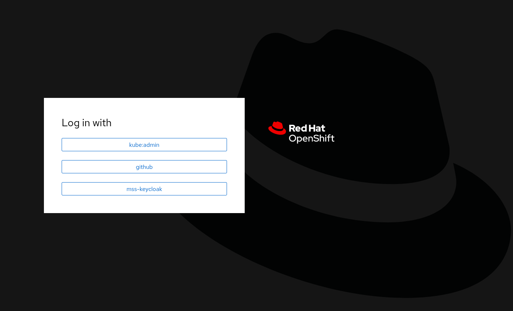
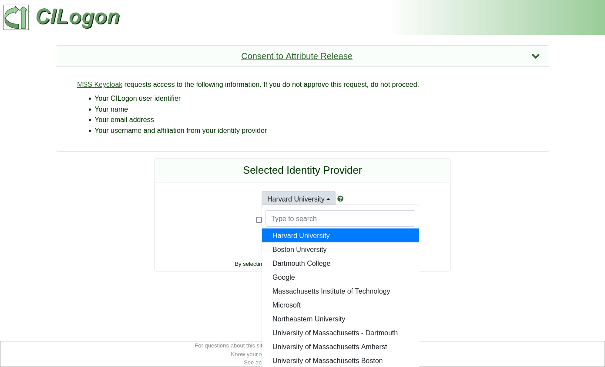

# Getting Secrets from OpenShift Console

Username and password for admin accounts of our services deployed on the
NERC OpenShift Platform (NERC-OCP) are stored as Kubernetes secrets, which
are accessible from the OpenShift web console. The console's URL is

https://console.apps.shift.nerc.mghpcc.org

A direct link to a secret looks like

https://console.apps.shift.nerc.mghpcc.org/k8s/ns/hosting-of-medical-image-analysis-platform-dcb83b/secrets/ackee-password

## How to Get a Secret's Value from the OpenShift Console

Click on the direct link to the secret, then log in.

Most of us log in using the "mss-keycloak" option, which redirects us to
university/academic institution login pages.

After logging in, you will see details about the secret.
Scroll down to the bottom section titled "Data". On the bottom right side
there are buttons to either reveal all values, or to copy-paste a specific value.

