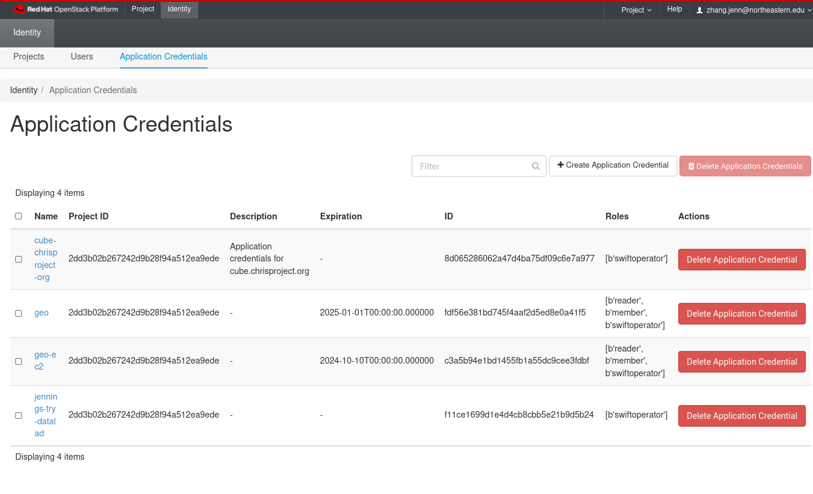
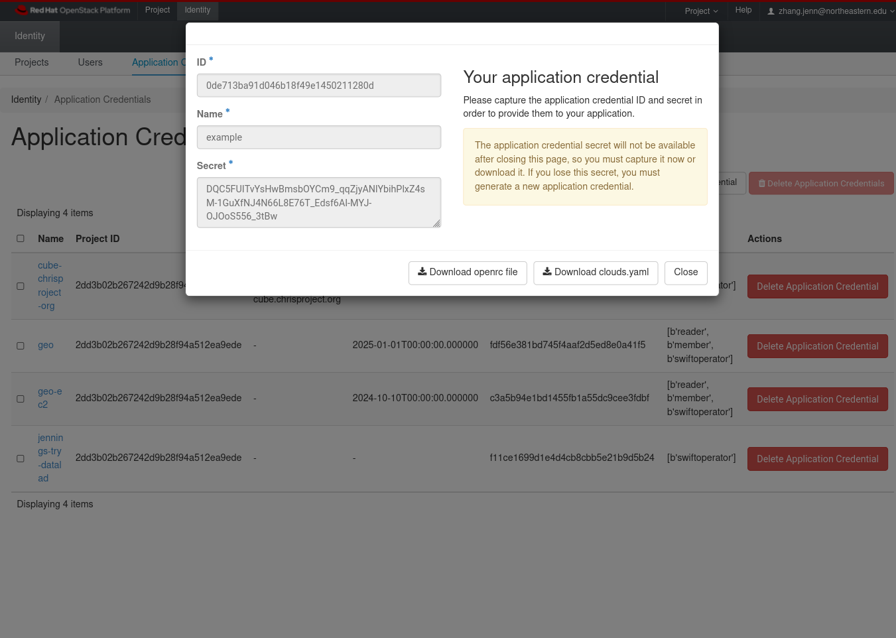

# Swift Storage

OpenStack Swift Object Storage (Swift) is somewhere we can use to store large static files.
It's not particularly convenient, but it is simple and cheap.

How to use Swift on NERC is described here:

https://nerc-project.github.io/nerc-docs/openstack/advanced-openstack-topics/persistent-storage/object-storage/

My recommendation is to use [`rclone`](https://rclone.org).

## Tips and Tricks

### Application Credentials

Following the official documentation section
["Configuring the AWS CLI"](https://nerc-project.github.io/nerc-docs/openstack/advanced-openstack-topics/persistent-storage/object-storage/#configuring-the-aws-cli)
tells you to obtain `EC2_ACCESS_KEY` and `EC2_SECRET_KEY` from "Project / API Access"
which is inconvenient because the login is only valid for about a day.
You can obtain credentials which are valid for a year by creating application credentials.

In the top bar click "Identity", then slightly below choose the tab "Application Credentials".



Click "Create Application Credential". Be sure to specify an expiration date to sometime far in the future.



Choose the option "Download openrc file".

Suppose you saved the file as `app-cred-example-openrc.sh`. In a terminal, run `source app-cred-example-openrc.sh`.
Then you will be able to run `openstack` CLI commands.

#### Create A new `EC2_ACCESS_KEY` and `EC2_SECRET_KEY` pair

```shell
openstack ec2 credentials create
```

#### List existing EC2 credentials

```shell
openstack ec2 credentials list
```

The "Access" and "Secret" can be used to configure `rclone` as described in the section
["Configuring rclone"](https://nerc-project.github.io/nerc-docs/openstack/advanced-openstack-topics/persistent-storage/object-storage/#configuring-rclone)

### Public Access

The `storage_url` of Swift can be found here as "Object Store":
https://stack.nerc.mghpcc.org/dashboard/project/api_access/

Alternatively, you can get it from the `swift auth` command:

```shell
eval "$(swift auth)"
echo "$OS_STORAGE_URL"
```

I have a public container called `fnndsc-public`. A plaintext list of its contents can be obtained from the URL
https://stack.nerc.mghpcc.org:13808/swift/v1/AUTH_2dd3b02b267242d9b28f94a512ea9ede/fnndsc-public/

To download a specific file from a public bucket, you need to join the container's URL with
the name of the file. For example, the file `presentations/jennings.zhang/2018_mcin_fetal_pipeline.pdf`
in the `fnndsc-public` bucket can be downloaded from
https://stack.nerc.mghpcc.org:13808/swift/v1/AUTH_2dd3b02b267242d9b28f94a512ea9ede/fnndsc-public/presentations/jennings.zhang/2018_mcin_fetal_pipeline.pdf

#### Downloading a Directory

Suppose you want to download an entire directory from a public container.
The file list to download can be obtained by running

```shell
curl -sf https://stack.nerc.mghpcc.org:13808/swift/v1/AUTH_2dd3b02b267242d9b28f94a512ea9ede/fnndsc-public/ \
    | grep '^meetings/recordings/BU_EC528/.*[^/]$'
```

Breaking it down:

- `curl` fetches a list of the entire contents of the public container `fnndsc-public`
- `grep '^meetings/recordings/BU_EC528/.*[^/]$'` selects only the files in the folder `meetings/recordings/BU_EC528/`,
  excluding directories.

I recommend using [GNU parallel](https://www.gnu.org/software/parallel/) to download these files in bulk.
Subdirectories need to be created before downloading files using `curl`.
For example:

```shell
PUBLIC_URL='https://stack.nerc.mghpcc.org:13808/swift/v1/AUTH_2dd3b02b267242d9b28f94a512ea9ede/fnndsc-public/'
directory='meetings/recordings/BU_EC528'

curl -sf "$PUBLIC_URL" \
    | grep "^$directory/.*[^/]\$" \
    | parallel -j4 --bar "mkdir -p '{//}' && curl -sfo '{}' '$PUBLIC_URL{}'"
```
