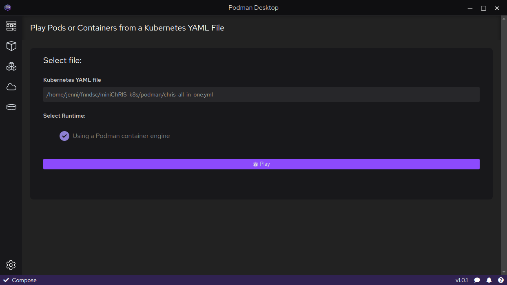
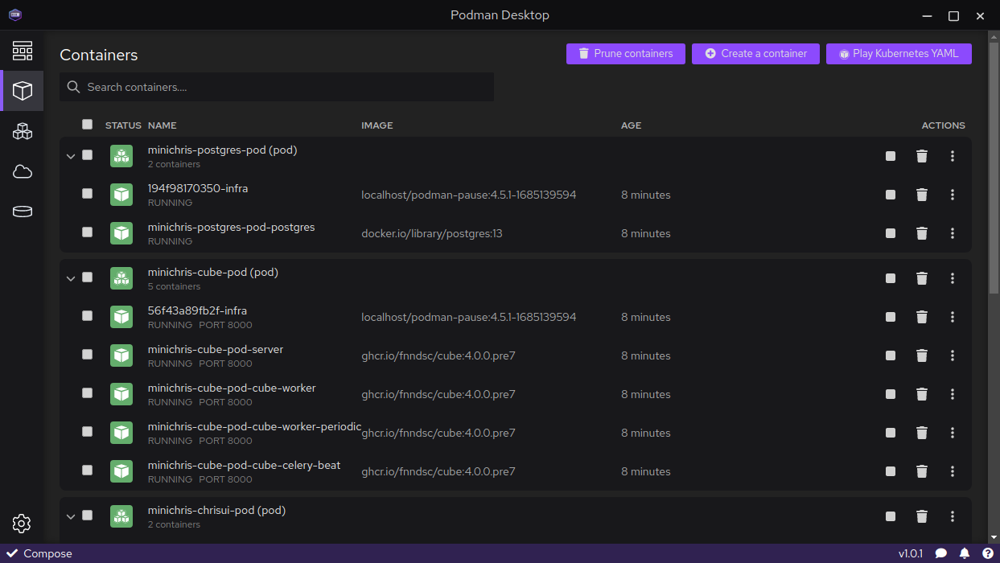

# _ChRIS_ on Podman

## System Requirements

_miniChRIS-podman_ requires Podman version 4.3 or above.
We aim to support "out-of-the-box" setups of rootless Podman (using slirp4netns and aardvark-dns).

Supported OS: Fedora Silverblue 37, Ubuntu 22.04, Arch Linux

<details>
<summary>
Notes about installing Podman on Arch Linux.
</summary>

On Arch Linux, please consult the wiki: https://wiki.archlinux.org/title/Podman

Here's what worked for me (possibly helpful, definitely outdated info)

```shell
sudo pacman -Syu podman aardvark-dns
sudo usermod --add-subuids 100000-165535 --add-subgids 100000-165535 $USER
```

</details>

## Preconditions

Make sure your system is not running anything which might interfere with _miniChRIS_.

- Existing container/pod names might clash with _miniChRIS_.
  To be safe, the output of `podman ps -a` should be empty-ish.
- Running servers might clash with _miniChRIS_, which wants to bind TCP ports
  5005, 5010, 8000, 8010, 8080, 8020, and 8021.

## Podman: Quick Start

```bash
git clone https://github.com/FNNDSC/miniChRIS-podman.git
cd miniChRIS-podman
./minichris.sh up
```

## Podman: Tear Down

```bash
./minichris.sh down
```

## Podman: Nuke

In case `./minichris.sh down` does not work, run:

```shell
podman pod rm -af
podman volume prune -f
```

This might happen if you change the YAMLs.

## Using Podman Desktop

It is necessary to feed to Podman Desktop a single YAML file defining all _ChRIS_ resources.
The YAML file is produced by the command `./minichris.sh cat`.

```shell
./minichris.sh cat > chris-all-in-one.yml
```

In the sidebar of Podman Desktop, click the "Containers" icon and then
in the top-right, click "Play Kubernetes YAML". Select the `chris-all-in-one.yml`
file and then click "Play."



Wait 1-5 minutes for _ChRIS_ to start up. Optionally, you can monitor the progress from a terminal with the command

```shell
./minichris.sh watch-migration
```

When it's done, return the Containers screen and you should see
_ChRIS_ containers running.



At this point _ChRIS_ is running, but it is empty. To add users and plugins to _ChRIS_,
go back to the terminal and run

```shell
./minichris.sh chrisomatic
```

Finally, you're ready to log in to http://localhost:8020 with username `chris`, password `chris1234`.

## Using Quadlet

The `podman/quadlet/minichris.kube` file can be used with the YAML generated by `./minichris.sh cat`
to deploy _ChRIS_ using [Quadlet](https://www.redhat.com/sysadmin/quadlet-podman).

```shell
systemctl --user start podman.service
./minichris.sh cat > ~/.config/containers/systemd/minichris-aio.yml
cp podman/quadlet/minichris.kube ~/.config/containers/systemd/minichris.kube
systemctl --user daemon-reload
systemctl --user start minichris.service
```

:::warning

Friendly reminder to not use _miniChRIS_ in production.

:::

## What to expect: performance

On a fast computer with good internet speed, running `./minichris.sh up`
for the first time (pulls images) takes about 1.5 to 2 minutes.
Subsequent runs will be faster, about 40 seconds.
