# ChRIS PACS Bulk Query & Retrieve — End-to-End Pipeline Manual

**ChRIS** · [chris.tch.harvard.edu](http://chris.tch.harvard.edu)

---

## Overview

This manual walks through the complete end-to-end workflow for running a PACS bulk query against ChRIS, downloading the results, and then using those results to drive a bulk retrieve (anonymized DICOM and NIfTI download) pipeline. The workflow has two parts:

- **Part A — Bulk Query:** search the PACS for studies/series matching criteria in a CSV spec, using the `pl-dyanon` plugin.
- **Part B — Bulk Retrieve:** take the query results, fill in retrieval instructions, and pull the matching DICOM/NIfTI data using the `pl-dypxflow` plugin.

> **Note:** Part B depends on the output of Part A — the query results CSV becomes the input spec (after editing) for the retrieve step.

### Prerequisites

- A valid single sign-on (LDAP) username and password for ChRIS.
- The CSV templates `bulk_query_spec.csv` (for Part A) and `bulk_retrieve_spec.csv` (for Part B).
- Recipient email address(es) to receive pipeline notifications.

### Reference Endpoints & Compute Environment

| Setting | Value |
|---|---|
| CUBE URL | `http://ekanite.tch.harvard.edu:32223/api/v1/` |
| PFDCM URL | `http://chris.tch.harvard.edu:3224/api/v1/` |
| PACS name | `PACSDCM` |
| Compute environment | `argentum` |

---

## Part A — Bulk Query

Use this workflow to search the PACS for studies matching a set of criteria (e.g. Patient ID and Study Date) and produce a results table.

### Step 1. Log in to ChRIS

1. Navigate to the ChRIS login page at chris.tch.harvard.edu.
2. Enter your LDAP username and password, then click **Log in**.

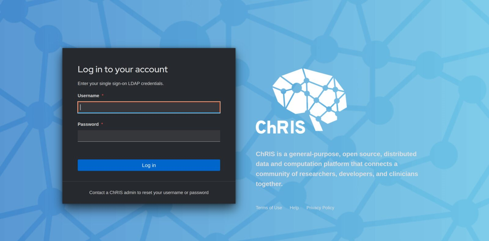

*Figure A1 — ChRIS single sign-on login screen*

### Step 2. Open the Analyses list

1. After logging in, you land on the **Private Feeds** view, which lists all analyses you have created, along with their creation date, creator, and status.
2. Click **Create Analysis** in the top-right corner to start a new one.

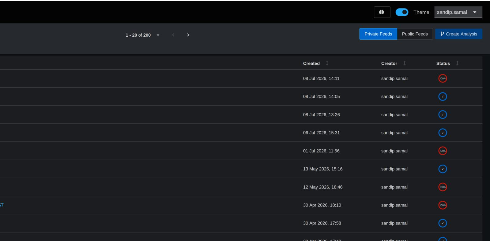

*Figure A2 — Private Feeds list, showing prior analyses and the Create Analysis button*

### Step 3. Create a new analysis

1. In the **Create a New Analysis** wizard, fill in the **Analysis Name** field (e.g. "bulk-query").
2. Optionally add an **Analysis Note** describing the purpose of the run, and any **Tags**.
3. Proceed to the next step of the wizard to select input data.

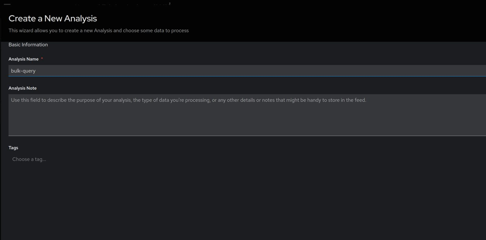

*Figure A3 — Create a New Analysis: Basic Information form*

### Step 4. Upload the query CSV template

1. On the data-selection screen, choose **Upload New Data** (or **Fetch Data from ChRIS** if the file is already registered).
2. Upload the `bulk_query_spec.csv` template, filled in with the desired `Search_PatientID`, `Search_StudyDate`, and any `Search_<tagName>` columns.
3. Finish the wizard to create the analysis (feed).

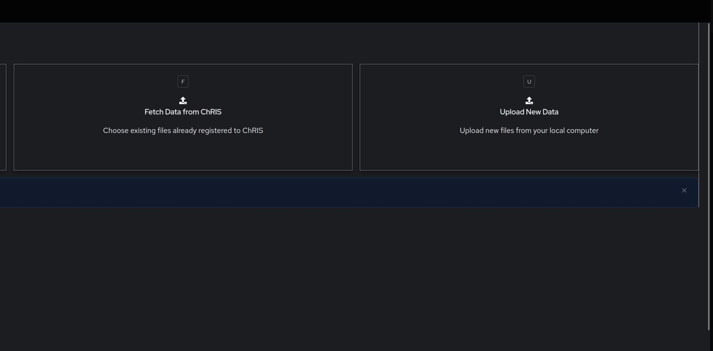

*Figure A4 — Data selection: Fetch Data from ChRIS vs. Upload New Data*

### Step 5. Add the pl-dyanon child node

1. Open the newly created analysis and locate the root node in the feed graph.
2. Right-click the root node and choose **+ Add a Child Node**.
3. Search for and select the plugin **pl-dyanon**.

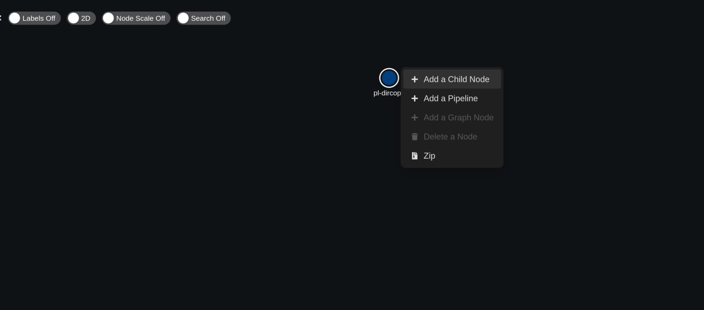

*Figure A5 — Add a Child Node context menu on the root node*

> **Note:** This context menu also offers **Add a Pipeline** and **Add a Graph Node**, and lets you **Zip** or **Delete** a node. Use **Add a Child Node** for a single plugin step.

### Step 6. Configure the pl-dyanon node

1. In the **Add a New Node** wizard, select the desired **Plugin Version** and **Compute environment** (`argentum`).
2. Check **Fill the form using a latest run of this plugin** to auto-populate the **Command Line Parameters** field.
3. If parameters are not auto-filled, paste the following into **Command Line Parameters**:

```
--CUBEurl http://ekanite.tch.harvard.edu:32223/api/v1/ --PFDCMurl http://chris.tch.harvard.edu:3224/api/v1/
--PACSname PACSDCM --recipients example@abc.com
--pipelineName 'Bulk PACS query pipeline using CUBE 20260325'
--reducePipelineName 'Tablify PACS query results using CUBE 20260402'
```

4. Click **Validate** to confirm the parameters resolve correctly, then click **Add Node**.

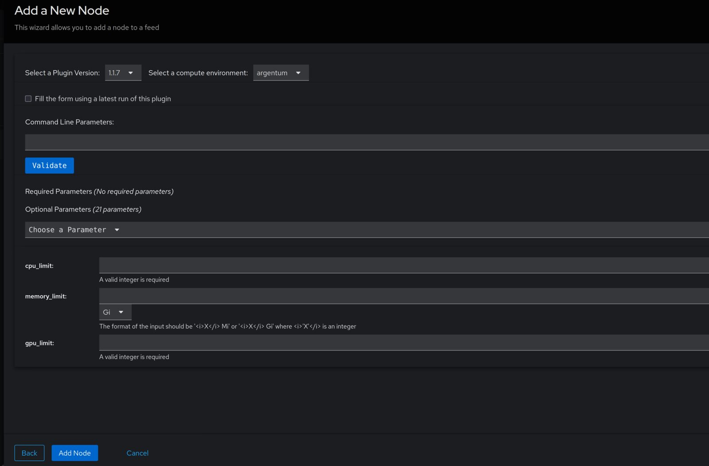

*Figure A6 — Add a New Node wizard, empty parameter form with cpu/memory/gpu limit fields*

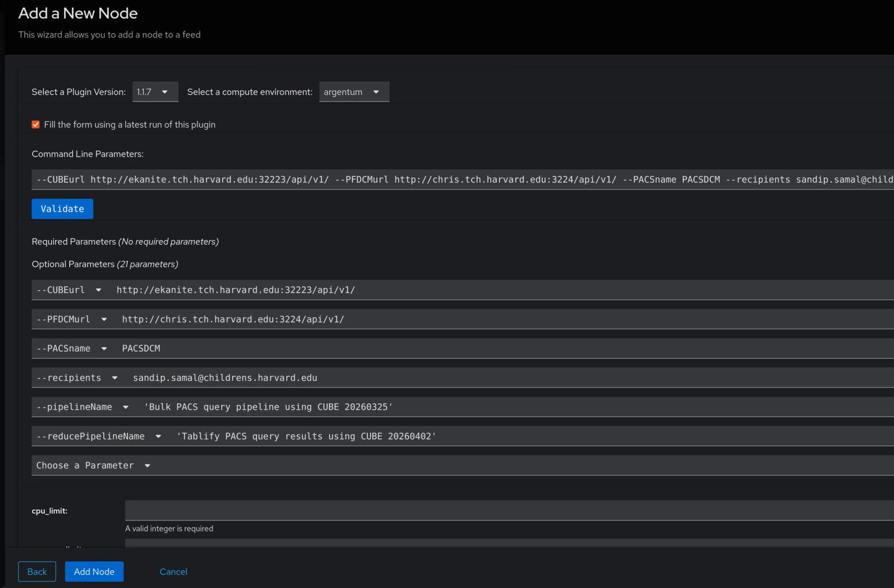

*Figure A7 — Add a New Node wizard for pl-dyanon, fully populated with --pipelineName and --reducePipelineName*

### Step 7. Confirm the node was added and monitor the pipeline

After adding the node, the feed graph updates to show the new pl-dircopy / pl-dyanon branch hanging off the root, fanning out into many parallel child nodes (one per search row / worker) that converge into the Tablify reduce step. Node color indicates status: blue nodes are running/queued, white nodes are pending, and red nodes indicate errors.

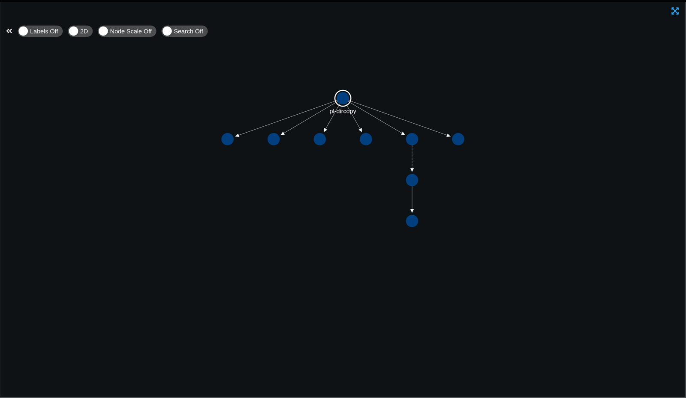

*Figure A8 — Feed graph after adding the pl-dircopy / pl-dyanon branch, fanning out across parallel worker nodes*

> **Note:** Wait for all branches to reach a completed (checkmark) status before proceeding to Part B. You will receive an email at the address given via `--recipients` when the run finishes.

---

## Part B — Bulk Retrieve

Use this workflow to retrieve (and optionally anonymize) the DICOM series identified by the bulk query, and convert them to NIfTI, using the `pl-dypxflow` plugin.

### Step 1. Download the query results

1. Navigate to the Tablify / JSON-to-table node produced at the end of Part A.
2. In the file browser panel, check the box next to `output_data.csv`.
3. Click the download icon (**Download selected items**) to save the file locally.

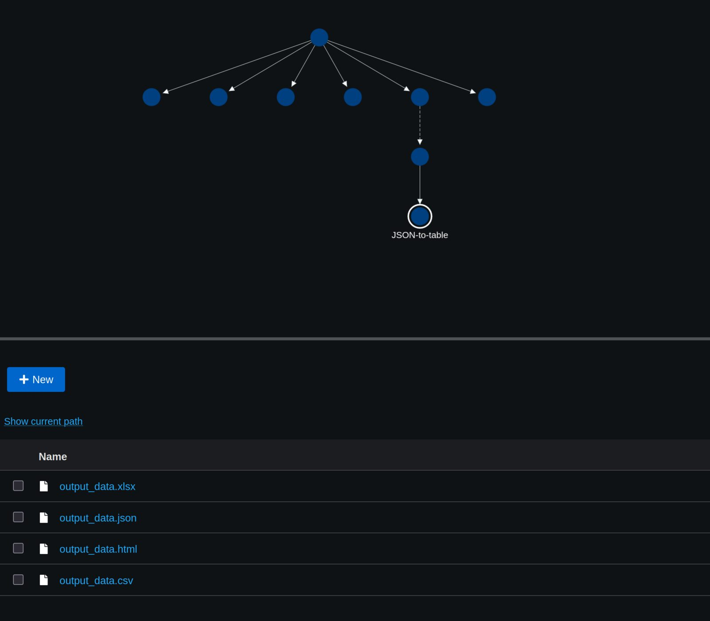

*Figure B1 — JSON-to-table node output files (nothing selected)*

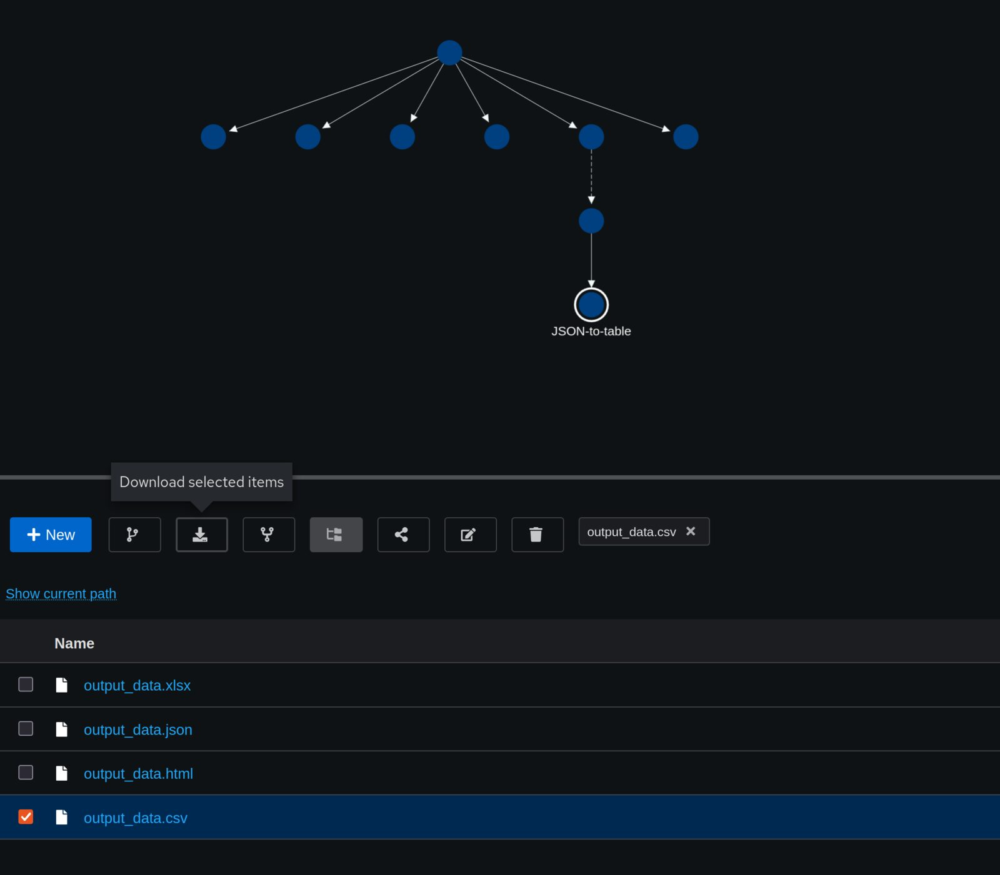

*Figure B2 — output_data.csv selected, ready to download via the download icon*

### Step 2. Prepare the retrieve CSV

Before uploading, edit the downloaded CSV so it matches `bulk_retrieve_spec.csv`:

- Rename the identifying columns to `Search_<column_name>` (e.g. `Search_AccessionNumber`).
- **Folder name** — the name of the output folder created for each record/row.
- **Dicom path**, **Dicom anonymized path**, and **Nifti path** — destination paths under the `/neuro` tree for each output type.
- **status** — set any character in this column to skip that row entirely.
- Leave `Dicom anonymized path` / `Nifti path` blank if you do not want anonymized DICOMs or NIfTI files saved.

**bulk_retrieve_spec.csv columns**

| Column                           | Purpose                                                                             |
|----------------------------------|-------------------------------------------------------------------------------------|
| `PatientID`                      | Patient identifier                                                                  |
| `PatientName`                    | Patient name                                                                        |
| `PatientBirthDate`               | Patient date of birth                                                               |
| `Modality`                       | Imaging modality (e.g. MR, CT, SR)                                                  |
| `StudyDate`                      | Date of the study                                                                   |
| `Search_AccessionNumber`         | Accession number used to locate the study on the PACS                               |
| `Search_SeriesDescription`       | Description of the series used to locate the sequence in the study                  |
| `NumberOfSeriesRelatedInstances` | Number of instances in the series                                                   |
| `Dicom path`                     | Destination path under `/neuro` for the retrieved DICOMs                            |
| `Dicom anonymized path`          | Destination path under `/neuro` for anonymized DICOMs (leave blank to skip)         |
| `Nifti path`                     | Destination path under `/neuro` for the converted NIfTI files (leave blank to skip) |
| `Folder name`                    | Name of the output folder created for this record/row                               |
| `status`                         | Set any character to skip this row                                                  |

### Step 3. Log in and create a new analysis for the retrieve step

1. Log in to ChRIS as in Part A (see [Figure A1](#step-1-log-in-to-chris)).
2. Open **Create Analysis**, give the analysis a name (e.g. "demo-retrieve-2"), and proceed through the wizard as in Part A Steps 2–4.
3. Upload the edited retrieve CSV from Step 2 above as the input data for the new analysis, instead of the query template.


*Figure B3 — ChRIS single sign-on login screen (reused from Part A)*

### Step 4. Add the pl-dypxflow child node

1. Open the new analysis and right-click the root (pl-dircopy) node.
2. Choose **+ Add a Child Node** from the context menu.
3. Search for and select the plugin **pl-dypxflow**.


*Figure B4 — Add a Child Node context menu on the pl-dircopy root node (reused from Part A)*

### Step 5. Configure the pl-dypxflow node

1. Select the plugin version (e.g. 1.1.5) and the `argentum` compute environment.
2. Check **Fill the form using a latest run of this plugin** to auto-populate parameters.
3. If parameters are not auto-filled, paste the following into **Command Line Parameters**:

```
--pattern '**/*.csv' --CUBEurl http://ekanite.tch.harvard.edu:32223/api/v1/
--PFDCMurl http://chris.tch.harvard.edu:3224/api/v1/ --PACSname PACSDCM
--recipients example@abc.com
```

4. Click **Validate**, then **Add Node**.

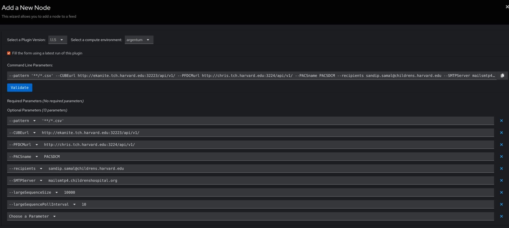

*Figure B5 — Add a New Node wizard for pl-dypxflow, fully populated command line parameters*

### Step 6. Monitor the retrieve pipeline

Once added, the node begins execution. The right-hand details panel shows live status (Waiting, Started, Transmitting, Computing) along with Feed Name, Parent/Selected Node IDs, Plugin version, Compute Environment, and Total Runtime.

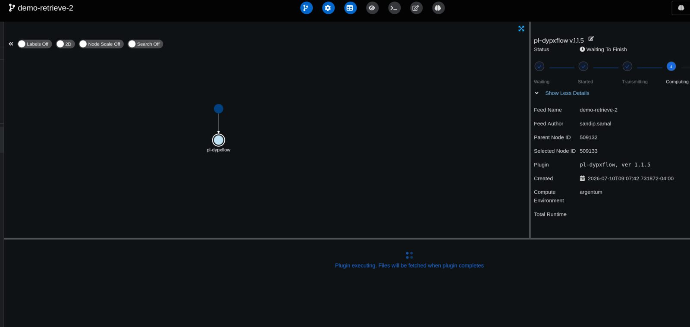

*Figure B6 — demo-retrieve-2 feed: pl-dypxflow node in the Computing stage, waiting to finish*

> **Note:** The message "Plugin executing. Files will be fetched when plugin completes" confirms the node is actively running.

### Step 7. Review the full pipeline graph

Once complete, the feed graph shows the full pipeline: the root node, the pl-dyanon / pl-dypxflow branches, and every downstream worker and reduce node. Completed nodes typically render blue; nodes needing attention render white or red.

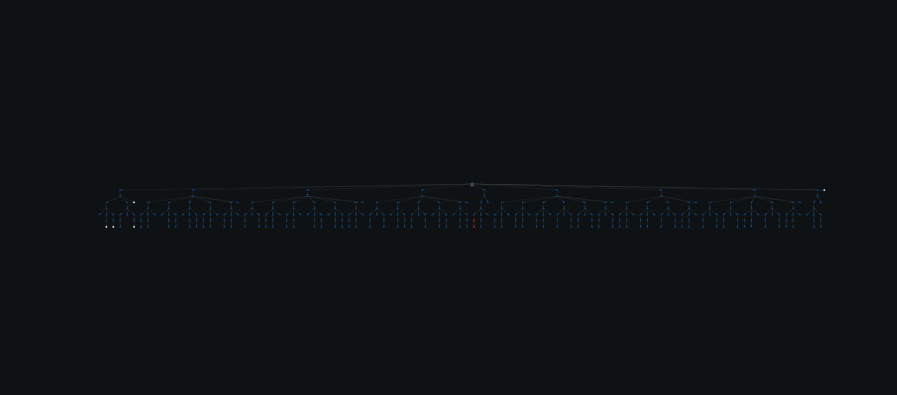

*Figure B7 — Complete end-to-end pipeline graph after the retrieve step finishes*

---

## Appendix: CSV Templates

### bulk_query_spec.csv

Used as the input for Part A. Each row specifies one search; add as many `Search_<tagName>` columns as needed.

| Search_PatientID | Search_StudyDate | Search_\<tagName\> |
|---|---|---|
| 1234567 | 19000101 | \<tagValue\> |

### bulk_retrieve_spec.csv

Used as the input for Part B, produced by editing the Part A query results. It contains the following columns:

| Column                           |
|----------------------------------|
| `PatientID`                      |
| `PatientName`                    |
| `PatientBirthDate`               |
| `Modality`                       |
| `StudyDate`                      |
| `Search_AccessionNumber`         |
| `Search_SeriesDescription`       |
| `NumberOfSeriesRelatedInstances` |
| `Dicom path`                     |
| `Dicom anonymized path`          |
| `Nifti path`                     |
| `Folder name`                    |
| `status`                         |

> See the full column-by-column description in [Part B, Step 2 — Prepare the retrieve CSV](#step-2-prepare-the-retrieve-csv).

---

## Quick Reference: Command Line Parameters

### pl-dyanon (Bulk Query)

```
--CUBEurl http://ekanite.tch.harvard.edu:32223/api/v1/ --PFDCMurl http://chris.tch.harvard.edu:3224/api/v1/
--PACSname PACSDCM --recipients example@abc.com
--pipelineName 'Bulk PACS query pipeline using CUBE 20260325'
--reducePipelineName 'Tablify PACS query results using CUBE 20260402'
```

### pl-dypxflow (Bulk Retrieve)

```
--pattern '**/*.csv' --CUBEurl http://ekanite.tch.harvard.edu:32223/api/v1/
--PFDCMurl http://chris.tch.harvard.edu:3224/api/v1/ --PACSname PACSDCM
--recipients example@abc.com
```
