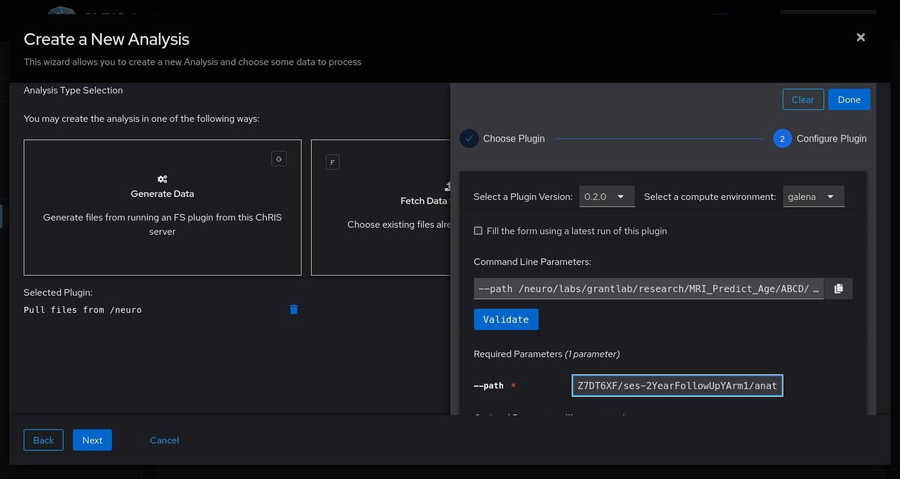
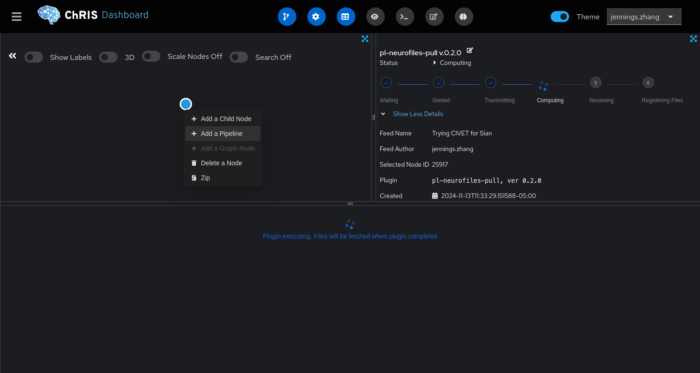
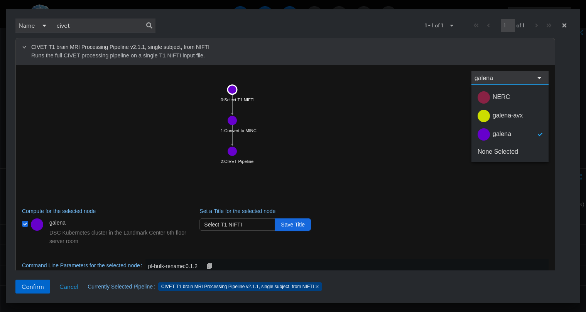
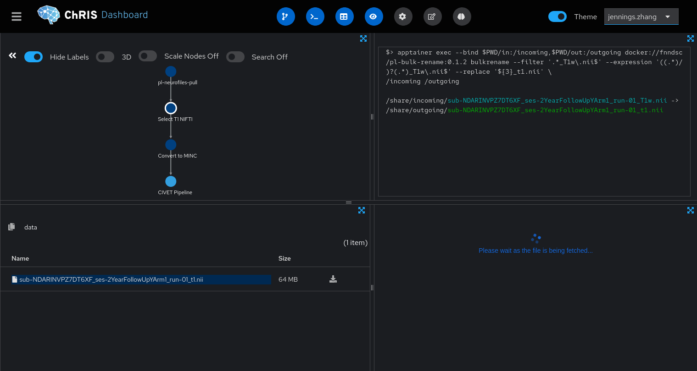

# Running CIVET on _ChRIS_ at FNNDSC

_CIVET_ is a T1 MRI processing pipeline (similar to FreeSurfer) developed at the Montréal Neurological Institute (MNI). This tutorial is a beginner-level walk-through of how to run _CIVET_ on _ChRIS_ at the FNNDSC.

### 1. Log in to _ChRIS_

Go to **http://chris-next.tch.harvard.edu:2222/login** and log in using your FNNDSC account username and password.

### 2. Create a feed

Data are imported into _ChRIS_ in _feeds._

1. Click **"Create Feed"** in the top-right corner. 
2. Choose the **"Generate Data"** option.
3. Select the `pl-neurofiles-pull` plugin, which pulls data from `/neuro/labs/grantlab/research` into _ChRIS_.
4. Specify which path to pull as the `--path` parameter.
5. Keep clicking "Next" until the feed is created.

The path you choose _must_ be a directory containing exactly one _NIFTI_ file called `*_T1w.nii`.
Any unrelated files (such as `*.json`, `*._T2w.nii`) will also be uploaded to _ChRIS_ but ignored by the pipeline.

### 3. Run the pipeline

Click into the feed you just created, and right-click the only circle in the top-left quadrant. Select **"Add a pipeline."**

Search for the "CIVET" pipeline and select it.

::::danger

Carefully review the pipeline's options before you run it. Make sure that each step of the pipeline is configured to run on **"galena,"** our private compute cluster. You may also choose "NERC," a public cloud, as long as your data does not contain PHI.

::::

Once the pipeline is running, you can see each of its steps and their statuses. You can see that the pipeline selects the `*_T1w.nii` file, renames it to `*_t1.nii`, then converts it to MINC.

### 4. Wait a couple hours

CIVET takes 4-8 hours to run to completion.

## Next Steps

You now know how to run _CIVET_ using the _ChRIS_ user interface.
Next steps might include visualization and downstream analyses of _CIVET_
outputs, or scaling up to run this pipeline on multiple subjects.
