# Infant FreeSurfer on _ChRIS_

[Infant FreeSurfer](https://surfer.nmr.mgh.harvard.edu/fswiki/infantFS) is a
modified FreeSurfer pipeline for infant brains spanning the 0&ndash;2 year age range.

This article is a complete walkthrough of how to run Infant FreeSurfer in _ChRIS_.

## 1. Upload Data in a Feed

After logging in, you can upload data to _ChRIS_ by creating a [feed](/docs/glossary#feed).
We need to create one feed per subject.

Find the "New and Existing Analysis" page in the sidebar.

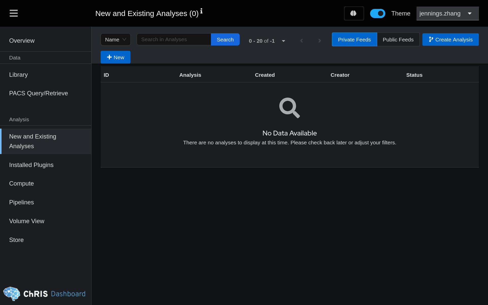

Click "Create Analysis" and provide a name for your feed.

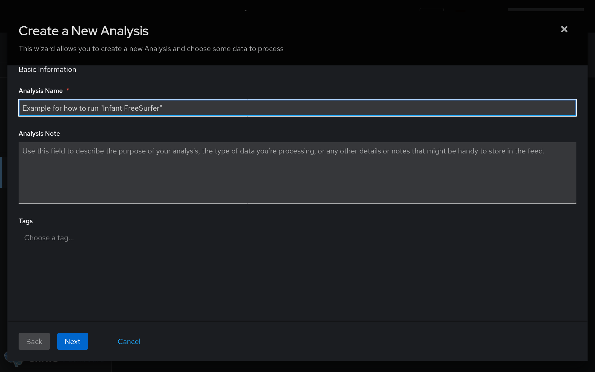

Click "Next", and choose the right-most option "Upload New Data" to select files
to upload from your local computer. In this example, we have selected a file
called "sub-01_T1w.nii.gz".

:::tip

`infant_recon_all` typically requires the input file to be named `mprage.nii.gz`.
Don't worry about this, the wrapper script of
[pl-infantfs](https://github.com/FNNDSC/pl-infantfs) takes care of finding
your input file and passing it to `infant_recon_all`.

:::

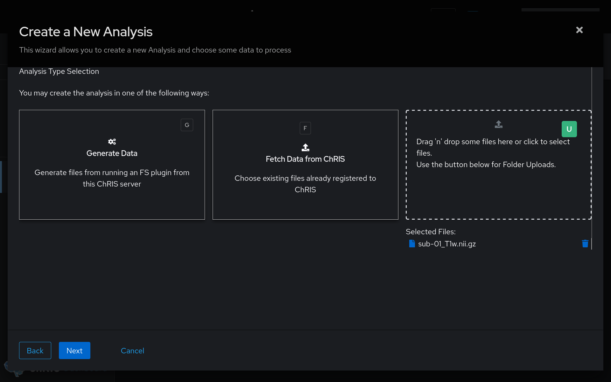

Click "Next." Skip the screen where it asks you to choose a pipeline.

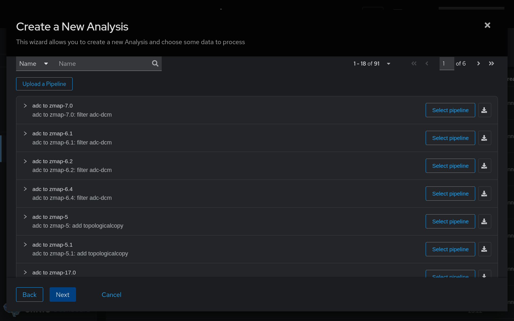

The final page of the wizard asks you to review the details. Click "Create Analysis."

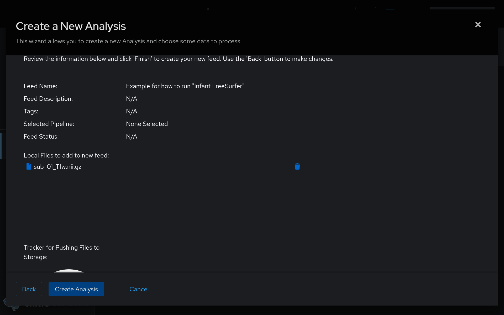

A few seconds after clicking "Create Analysis", the wizard will automatically close
and a new row will appear in the feed table. Click the name of your newly created feed.

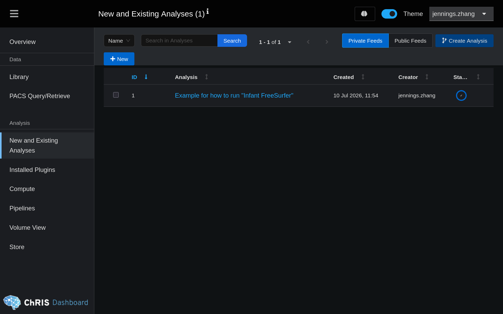

## 2. Run the `pl-infantfs` plugin

You are now looking at the feed view. There should be one circle containing
the input data uploaded during the previous step. **Right click** on the
circle and choose "Add a Child Node".

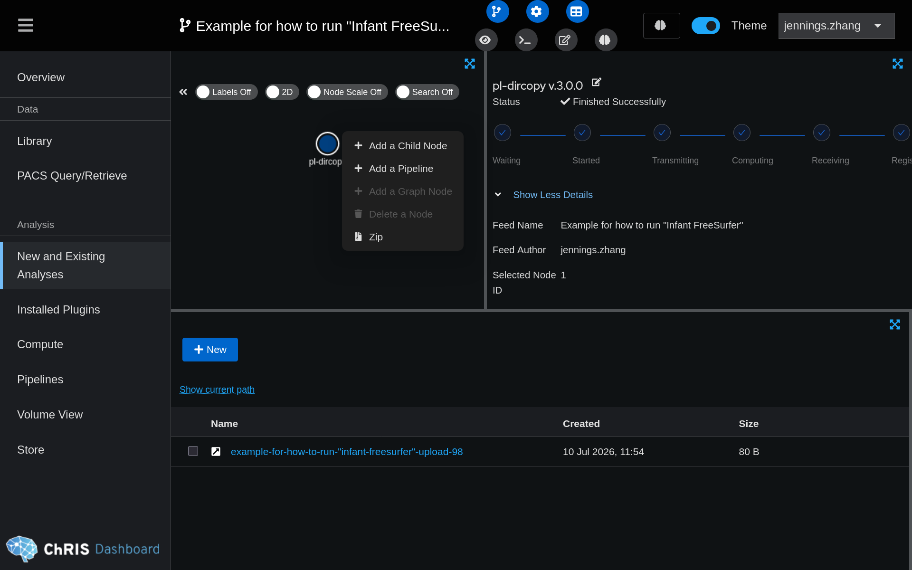

Search for the plugin "pl-infantfs".

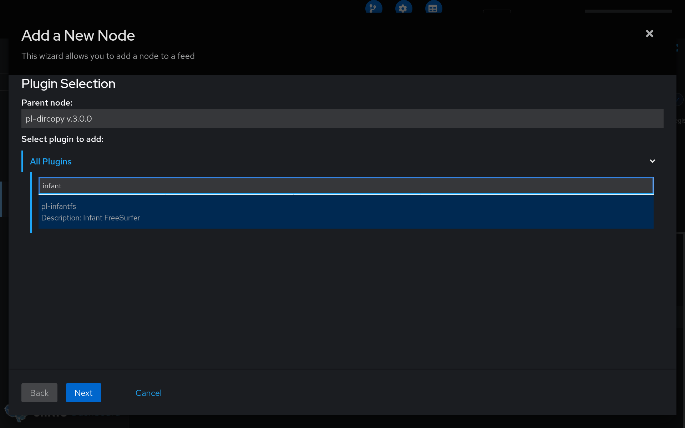

Click "Next." Here, you will need to fill out the parameters for Infant FreeSurfer.

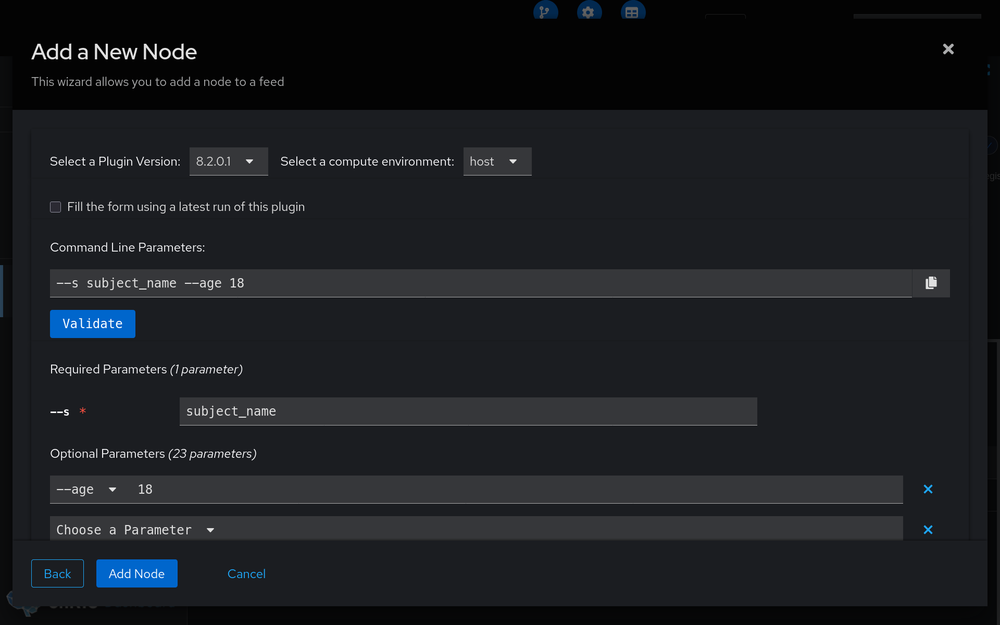

### Infant FreeSurfer Parameters

| Parameter | Description                                                                             |
|-----------|-----------------------------------------------------------------------------------------|
| `--s`     | Subject name. Provide an arbitrary text value, it will affect the name of output files. |
| `--age`   | Age of the subject in months.                                                           |

For more options, see https://surfer.nmr.mgh.harvard.edu/fswiki/infantFS

### Checking the progress

import FaTerminal from "./fa-terminal-solid-full.svg";

export const TerminalIcon = () => (
  
    <FaTerminal style={{ width: "18px", height: "18px" }} />
  
);

Click the <TerminalIcon /> icon found in the top bar to see the terminal logs.

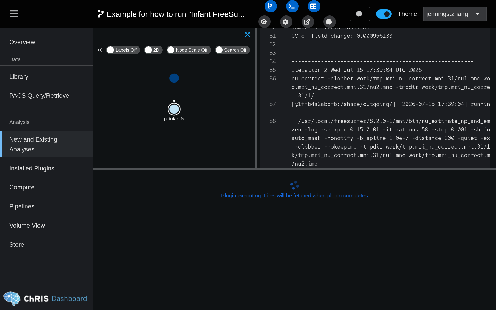

## 3. Downloading output files

import FaDownload from "./fa-download-solid-full.svg";

export const DownloadButton = () => (
  
    <FaDownload style={{ width: "16px", height: "16px" }} />
  
);

Output files will appear in the bottom panel when the pipeline is done running.

To download files, select a file by clicking the <input type="checkbox" checked /> checkbox
to the left, and then click the <DownloadButton /> button.

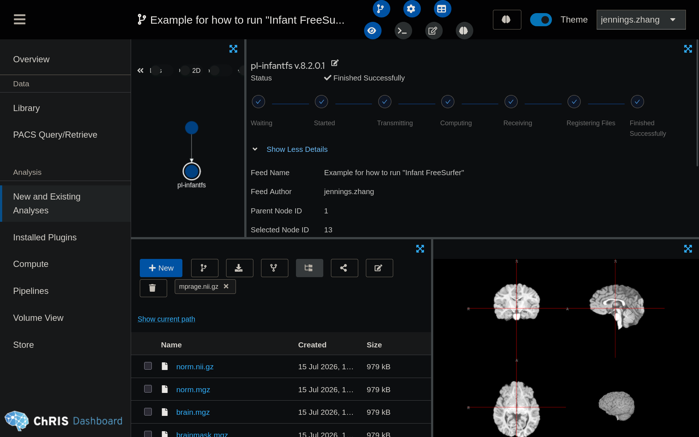

:::tip

FNNDSC internal users can push files directly from _ChRIS_ to `/neuro/labs/grantlab/research`
by running `pl-neurofiles-push`.

:::

