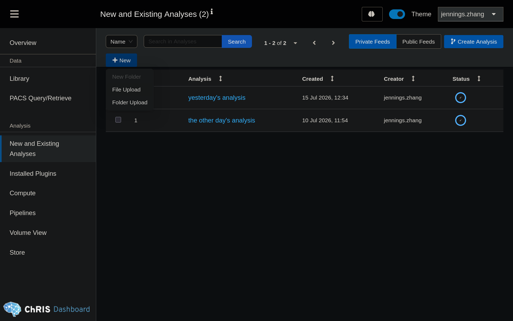
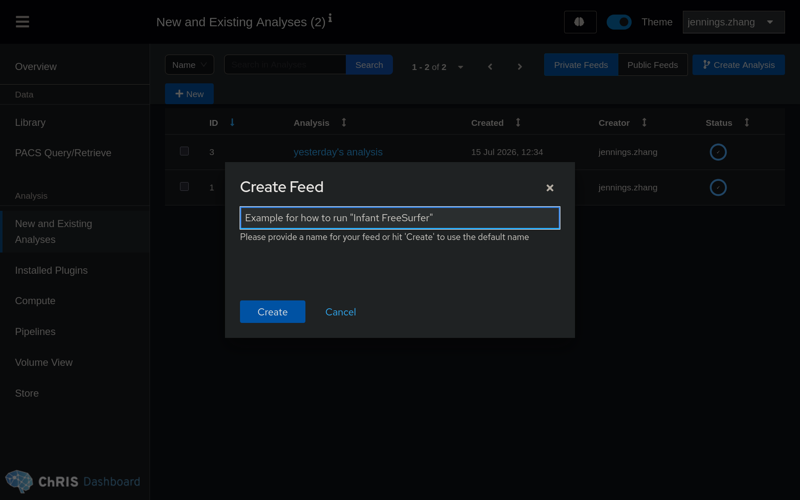
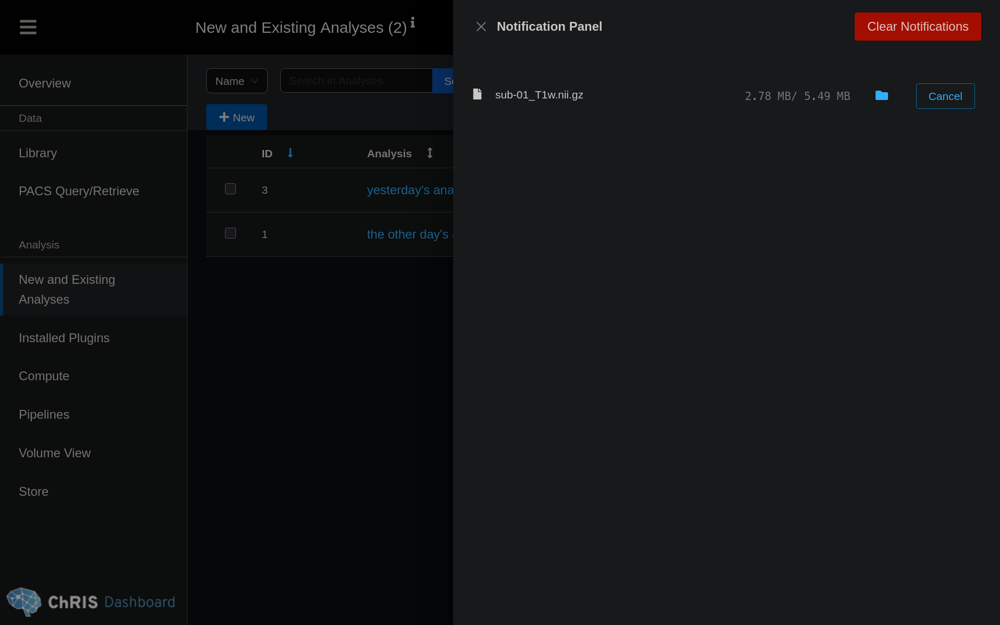
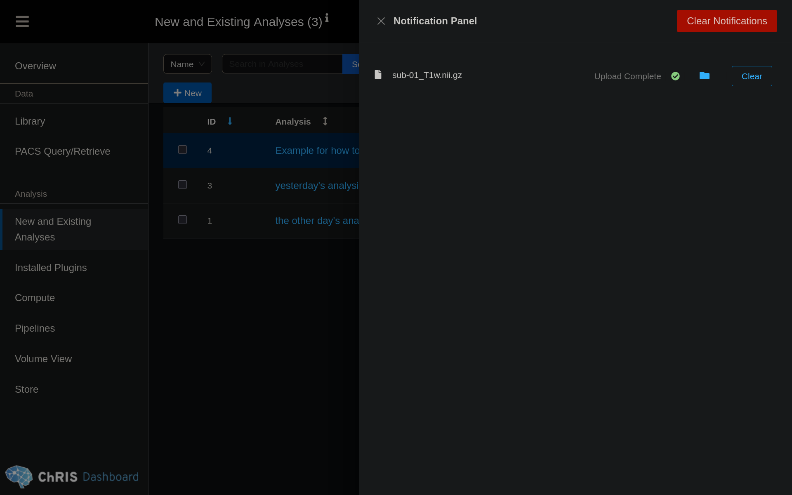
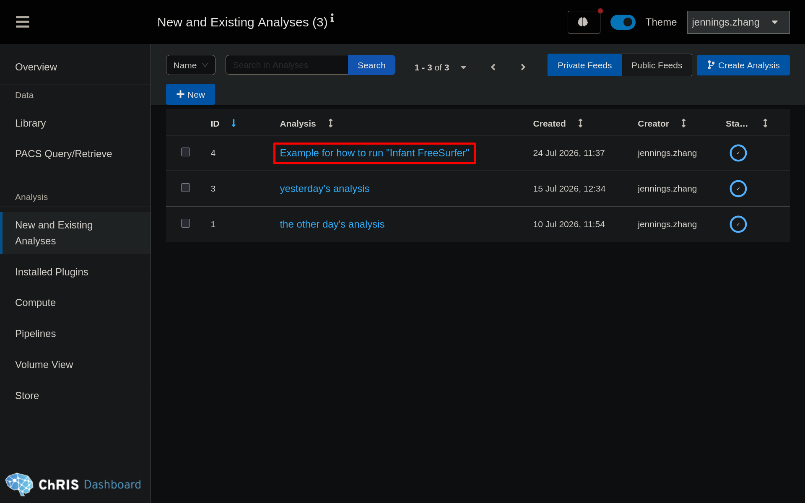
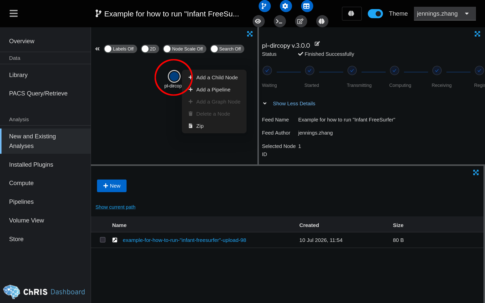
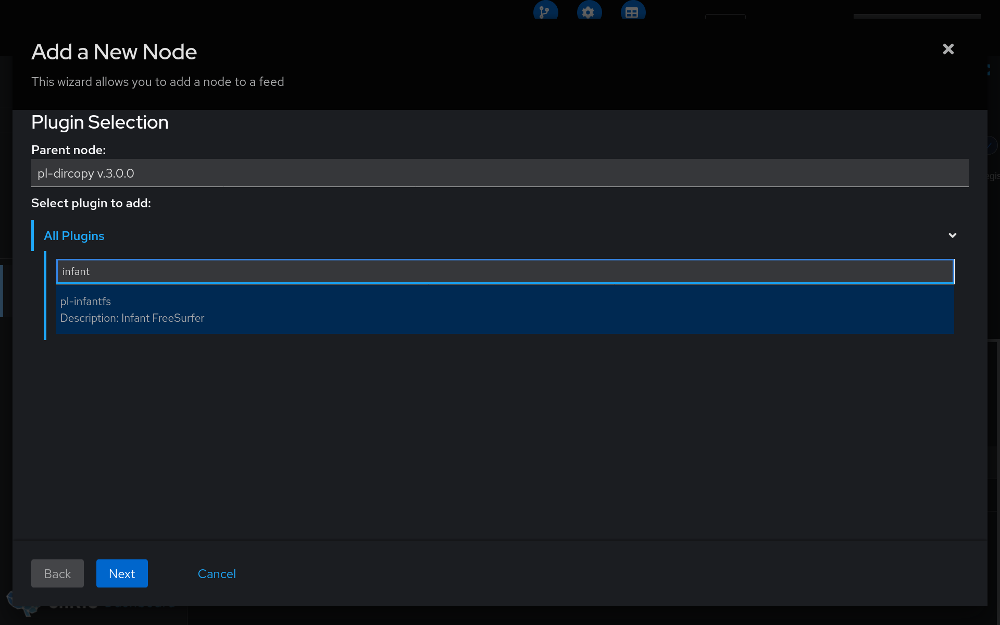
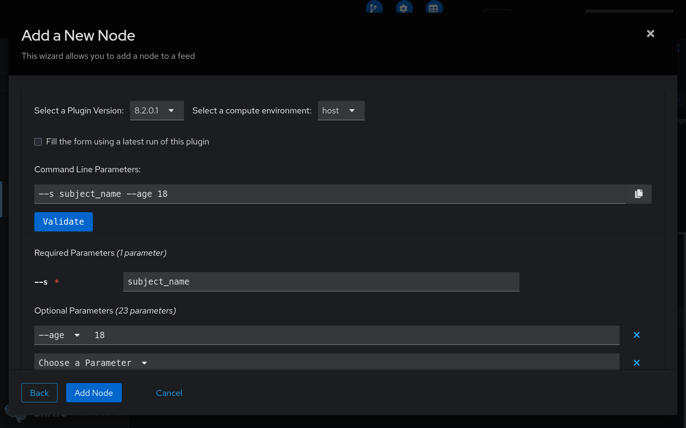
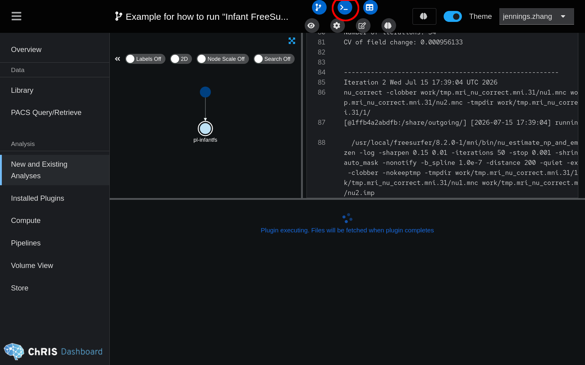
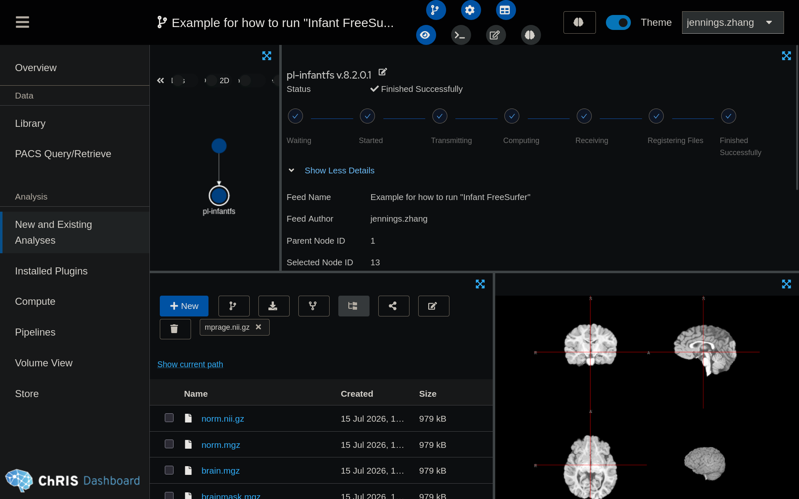

# Infant FreeSurfer on _ChRIS_

[Infant FreeSurfer](https://surfer.nmr.mgh.harvard.edu/fswiki/infantFS) is a
modified FreeSurfer pipeline for infant brains spanning the 0&ndash;2 year age range.

This article is a complete walkthrough of how to run Infant FreeSurfer in _ChRIS_.

## 1. Upload Data in a Feed

After logging in, you can upload data to _ChRIS_ by creating a [feed](/docs/glossary#feed).
We need to create one feed per subject.

import FaPlusIcon from "./fa-plus-solid-full.svg";

export const NewFeedButton = () => (
  <button
    style={{
      padding: "6px 12px",
      display: "inline-flex",
      flexDirection: "row",
      border: "none",
      borderRadius: "2px",
      background: "#1253b0",
      gap: "4px"
    }}
  >
    <FaPlusIcon style={{ height: "14px", width: "14px" }} />
    New
  </button>
)

Find the "New and Existing Analysis" page in the sidebar. On this page, click
<NewFeedButton />, and click "File Upload".

Click "Next", and choose the right-most option "Upload New Data" to select files
to upload from your local computer. In this example, we have selected a file
called "sub-01_T1w.nii.gz".

:::tip

`infant_recon_all` typically requires the input file to be named `mprage.nii.gz`.
Don't worry about this, the wrapper script of
[pl-infantfs](https://github.com/FNNDSC/pl-infantfs) takes care of finding
your input file and passing it to `infant_recon_all`.

:::

After choosing a file, it will ask you to name your feed. Provide a description
of your task here.

export const CreateButton = () => (
  <button
    style={{
      padding: "6px 18px",
      border: "none",
      borderRadius: "2px",
      background: "#1253b0",
    }}
  >
    Create
  </button>
)

Click <CreateButton />. You will then see the notification drawer open.

Wait 1&ndash;10 seconds for the file upload to finish.

Behind the notification drawer, a new row will appear in the table. At this point
you can close the notification drawer. Click the name of the feed to open it.

## 2. Run the `pl-infantfs` plugin

You are now looking at the feed view. There should be one circle containing
the input data uploaded during the previous step. **Right click** on the
circle and choose "Add a Child Node".

Search for the plugin "pl-infantfs".

Click "Next." Here, you will need to fill out the parameters for Infant FreeSurfer.

### Infant FreeSurfer Parameters

| Parameter | Description                                                                             |
|-----------|-----------------------------------------------------------------------------------------|
| `--s`     | Subject name. Provide an arbitrary text value, it will affect the name of output files. |
| `--age`   | Age of the subject in months.                                                           |

For more options, see https://surfer.nmr.mgh.harvard.edu/fswiki/infantFS

### Checking the progress

import FaTerminal from "./fa-terminal-solid-full.svg";

export const TerminalIcon = () => (
  
    <FaTerminal style={{ width: "18px", height: "18px" }} />
  
);

Click the <TerminalIcon /> icon found in the top bar to see the terminal logs.

## 3. Downloading output files

import FaDownload from "./fa-download-solid-full.svg";

export const DownloadButton = () => (
  
    <FaDownload style={{ width: "16px", height: "16px" }} />
  
);

Output files will appear in the bottom panel when the pipeline is done running.

To download files, select a file by clicking the <input type="checkbox" checked /> checkbox
to the left, and then click the <DownloadButton /> button.

:::tip

FNNDSC internal users can push files directly from _ChRIS_ to `/neuro/labs/grantlab/research`
by running `pl-neurofiles-push`.

:::

