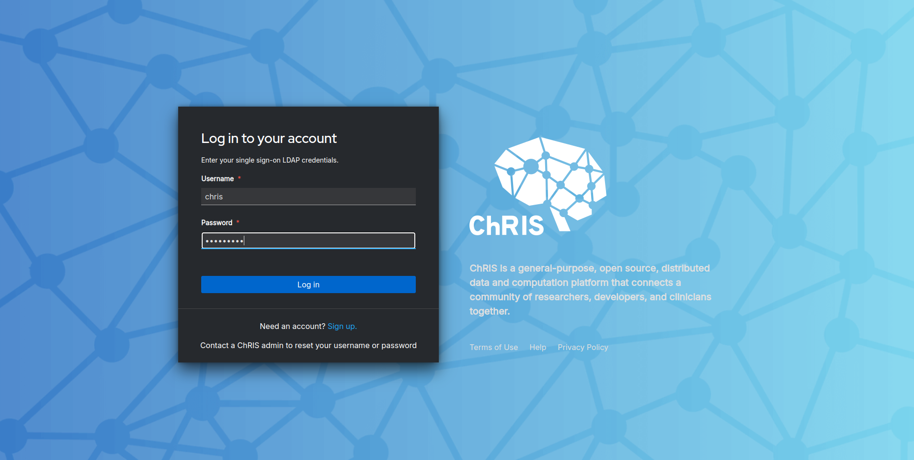
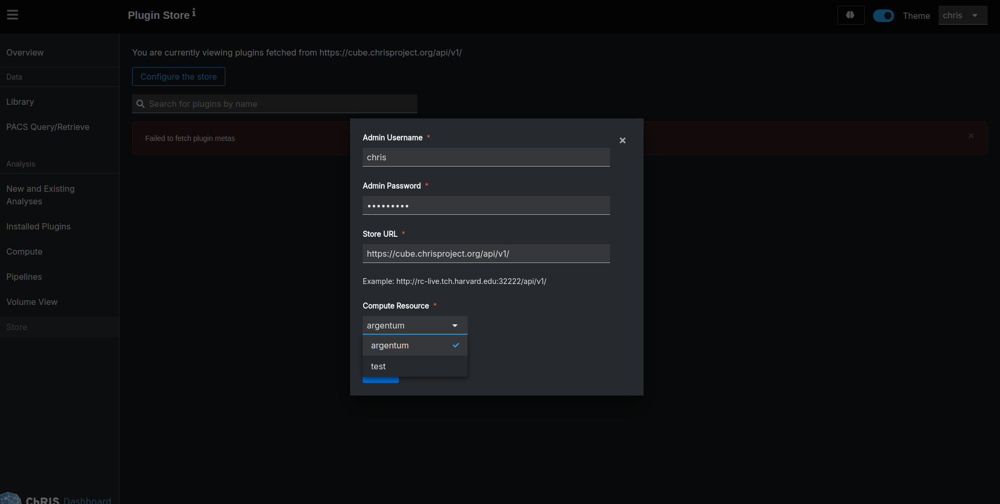
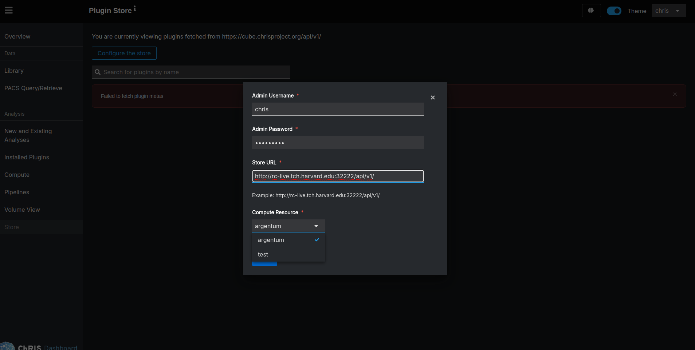
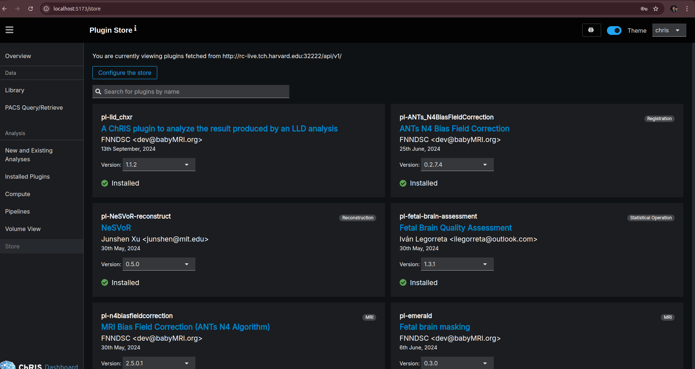
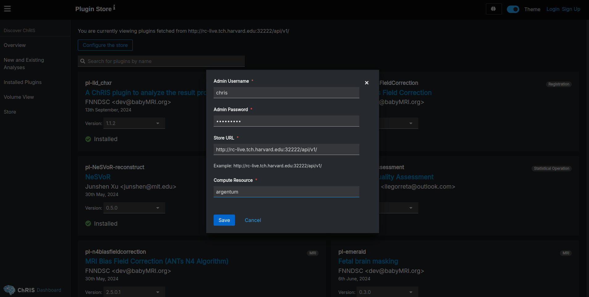
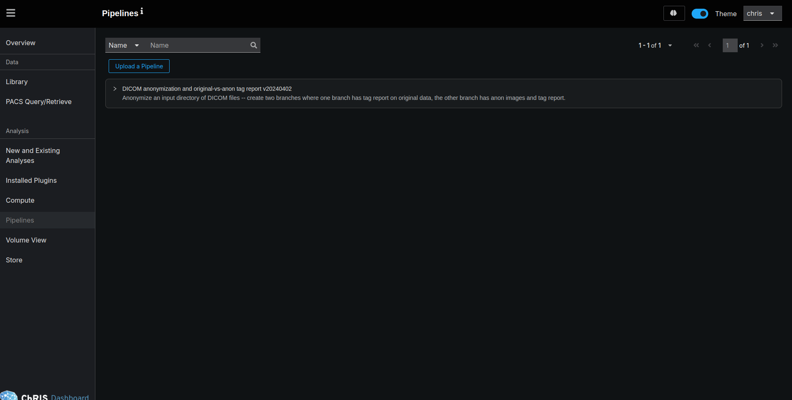

### How to fetch Plugins via a Store

When you install ChRIS using miniChRIS Docker, you might find that you need additional plugins for your projects. The ChRIS Store is a centralized repository where you can discover and install plugins directly into your local ChRIS instance. This tutorial will show you how to:

- Access the ChRIS Store within the ChRIS UI.
- Configure store settings based on your user status.
- Search for and install plugins.
- Upload pipeline source files that automatically include missing plugins.

## Prerequisites

- ChRIS Installed Locally: You should have ChRIS installed using miniChRIS Docker. If not, follow the installation guide at https://github.com/FNNDSC/miniChRIS-docker
- ChRIS UI Access: Ensure that you can access the ChRIS UI in your web browser with the guide at https://github.com/FNNDSC/ChRIS_ui/
- Admin Credentials: If you're an admin user, have your username and password ready. For miniChRIS Docker setups, the default admin username is chris, and the password is chris1234.

## Accessing the ChRIS Store
Open the ChRIS UI: Navigate to your local ChRIS UI in your web browser. This is typically at http://localhost:8042 (using miniChRIS docker) or http://localhost:5173 (using vite and pnpm).

Navigate to the Store: Once in the UI, look for the Store tab. This is where you can browse and install plugins.

Before installing plugins, you may need to configure the store settings, depending on whether you're logged in as an admin user or not

### For Logged-In Admin Users
1. Log In: Click on the Login button and enter your admin credentials.

2. Access Store Configuration: After logging in, click on the Configure the Store button in the Plugin Store section.

3. Review Pre-Filled Values: The configuration form will appear with some pre-filled values. Since you're logged in as an admin, you don't need to provide the admin username and password again.

4. Set Store URL (Optional): If you're on an internal network and have a different store URL, update the Store URL field accordingly. Otherwise, you can keep the default.

5. Set Compute Resource: Ensure the Compute Resource field is set correctly. If you have compute resources configured, select the appropriate one from the dropdown.

6. Save Configuration: Click Save to apply the settings. The UI will now display the available plugins from the configured store.

### For Non-Staff or Not Logged-In Users
1. Access Store Configuration: Without logging in, click on the Configure the Store button in the Plugin Store section.

2. Fill in Required Fields:
- Admin Username: Enter chris (or your admin username if different).
- Admin Password: Enter chris1234 (or your admin password if different).
- Store URL: Enter the URL of the ChRIS Store API.
- Compute Resource: Enter the name of your compute resource. If you don't know it, you can use host as a default.

3. Save Configuration: Click Save to apply the settings.

Note: The admin credentials are required here because, as a non-staff user, you need explicit permission to install plugins from the store.

### Instaling Plugins

1. Select a Plugin: Choose the plugin you want to install.
2. Select Plugin Version (if applicable): Some plugins have multiple versions available.
3. Use the Version dropdown to select the desired version.
4. Once installed, the plugin card will show an Installed indicator with a checkmark.
5. Notifications: You may receive a success notification confirming the installation.

Note: If there are any issues during installation, an error notification will appear with details.

### Uploading Pipeline Source Files

With the store configured and plugins installed, you can upload pipeline source files in .json or .yml formats.

1. Navigate to Pipelines: Go to the Pipelines section in the ChRIS UI.

2. Upload Pipeline: Click on Upload Pipeline and select your .json or .yml file.

3. Automatic Plugin Installation: If the pipeline requires plugins that are not yet installed, the UI will automatically install them for you.  This feature relies on the store configuration set  earlier. 

4. Confirmation: Once the pipeline and required plugins are installed, you can proceed to use the pipeline within your workflows.