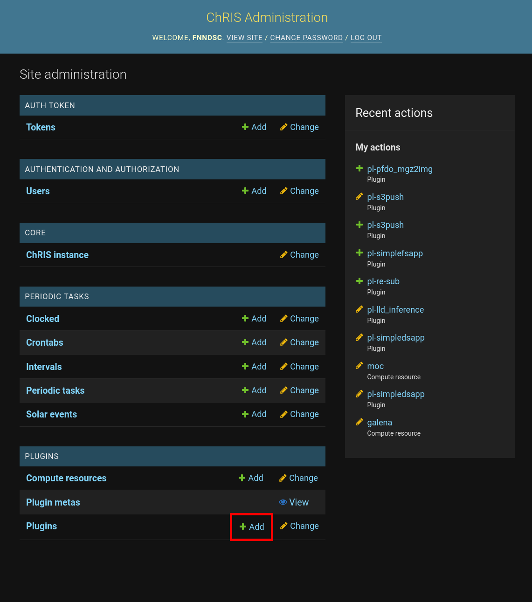
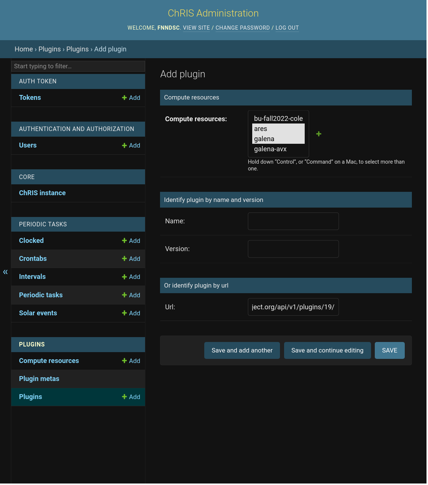

# How to Upload a ChRIS Plugin

This is the final step to bringing your science to the world!

:::tip

In this tutorial, we will be using the CUBE `https://cube.chrisproject.org/api/v1/`.
If you are using a different or private instance of _ChRIS_, simply change the URL.

:::

## Prerequisites

Only "staff" user accounts may upload _ChRIS_ plugins.

Before you upload plugins, your CUBE must have compute resources for the plugin to
be registered to. These can be created either using
[chrisomatic](#bulk-upload) or the [Django Dashboard](#using-the-django-dashboard),
both described below.

## Using the Django Dashboard

From the _Django Dashboard_ you can upload a plugin from one _ChRIS instance_ to another.
You can find publicly available plugins at https://app.chrisproject.org/catalog

Log in at https://cube.chrisproject.org/chris-admin/. From here you can do administrative
tasks such as connecting compute resources or adding plugins. To add a plugin, click on the
"+ Add" button to the right of "Plugins" at the bottom of the page.



Fill out the "Add plugin" form. You need to select one or more compute resources.
Ignore the "Identify plugin by name and version" section and type the URL of the plugin
from the other _ChRIS_ instance in the "Url" box.

:::tip

A plugin URL usually ends with `api/v1/plugins/N/`, e.g.
`https://cube.chrisproject.org/api/v1/plugins/19/`.

:::



## Using the API

To upload a plugin using the _ChRIS_ admin API, you'll either need:

- The plugin URL from another _ChRIS_ instance
- A JSON description file

The schema of a plugin JSON description file is described by the
[plugin spec](https://github.com/FNNDSC/CHRIS_docs/blob/master/specs/ChRIS_Plugins.adoc#json-representation).
The most common way to obtain a JSON description of a plugin is by running the
`chris_plugin_info` command, which is provided by the [`chris_plugin`](https://pypi.org/project/chris-plugin/)
Python package. Note that the `chris_plugin_info` command only works for _ChRIS_ plugins
written in Python using the `@chris_plugin.chris_plugin` decorator.

### Upload a JSON Description File

Suppose you have a Python-based _ChRIS_ plugin container image `fnndsc/pl-example:1.2.3`.
Its JSON description file can be created and written to the file `description.json` by running

```shell
docker run --rm -it fnndsc/pl-example:1.2.3 chris_plugin_info -d fnndsc/pl-example:1.2.3 > description.json
```

To upload the file `description.json` and register it to the compute resources `cluster1` and `cluster2`:

```shell
curl -u "$username:$password" https://cube.chrisproject.org/chris-admin/api/v1/ \
    -H 'Accept: application/json' \
    -F fname=@description.json \
    -F compute_names=cluster1,cluster2
```

### Upload Plugin by URL Using API

```shell
curl -u "$username:$password" https://cube.chrisproject.org/chris-admin/api/v1/ \
    -H 'Accept: application/json' \
    -H 'Content-Type: application/json' \
    --data '{"plugin_store_url": "https://cube.example.org/api/v1/plugins/19/", "compute_names": "cluster1,cluster2"}'
```

## Bulk Upload

Use [chrisomatic](https://github.com/FNNDSC/chrisomatic) to upload a list of plugins to _ChRIS_ in bulk.

## Automatic Plugin Upload

_ChRIS_ plugin GitHub repositories can be configured to be automatically uploaded
using [GitHub Actions](../../plugins/github_actions.md).

## Non-canonical methods

While not _officially_ supported, a python helper script, [plugin2cube](https://github.com/FNNDSC/plugin2cube), is available that can effect registration by directly speaking to the `CUBE` API.

In some cases this can be a quicker/simpler way to register a plugin. It does however require the `CUBE` *admin* username and password and knowledge of the compute environments on a `CUBE`, and assumes that the host executing the script has `docker` installed.

For example:

```shell
plugin2cube --CUBEurl http://rc-live.tch.harvard.edu:32222/api/v1/ \
            --CUBEuser XXXXXX --CUBEpasswd  XXXXXX                 \
            --computenames galena-avx --dock_image ghcr.io/fnndsc/pl-dicom_repack:1.1.4
```
