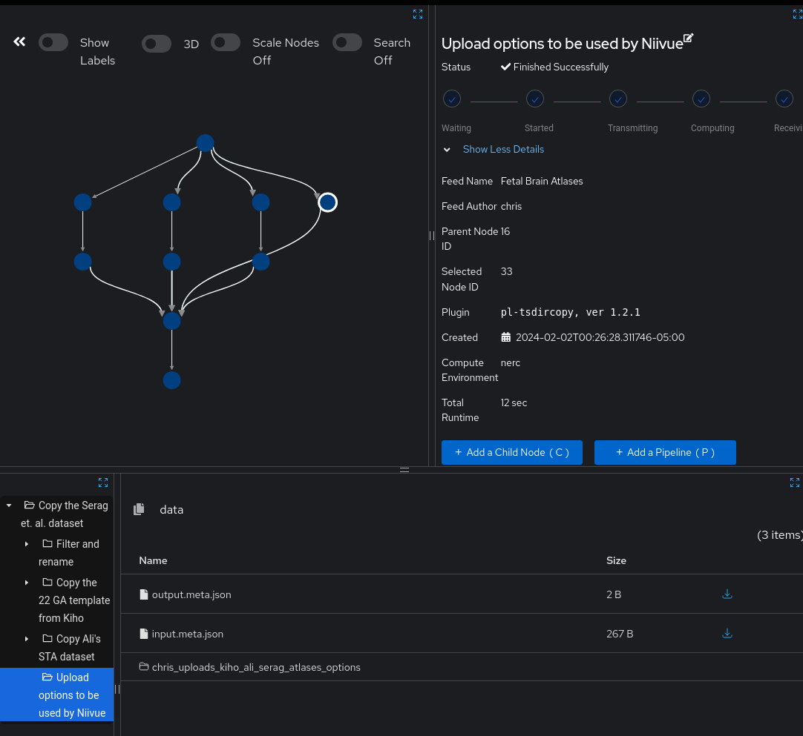

To see a dataset in the Visual Dataset Browser, create a plugin instance of
[pl-visual-dataset](https://app.fetalmri.org/plugin/7).
The parameters for `pl-visual-dataset` are also used to assign tags to files
and associate metadata with tag sets such as author, academic references, and
default Niivue options.

:::tip

This documentation is for `pl-visual-dataset` version `0.3.0`, which currently
[supports `.nii.gz`, `.nii`, and `.mgz` volumes](https://github.com/FNNDSC/pl-visual-dataset/blob/v0.2.0/visualdataset/index_brain_dir.py#L8-L13).

:::

## Well-Known Modes

Currently, there are three modes:

- [FreeSurfer](https://surfer.nmr.mgh.harvard.edu/): `--mode=freesurfer-7.3.3`
- [MALP-EM](https://github.com/ledigchr/MALPEM/): `--mode=malpem-1.3`
- Everything mode (no arguments)

When you use a value for `--mode`, `pl-visual-dataset` will select known output files from the specified
program  and associate them with tags. For example, `--mode=freesurfer-7.3.3` will cause the file
`mri/aparc.DKTatlas+aseg.mgz` to be recognized as a volume containing labels needing the `FreeSurferColorLUT.txt`
color map.

If `pl-visual-dataset` is run without arguments, all supported files (NIFTI, MGZ) will be matched, but
but no tags will be associated.

## Advanced: Matchers and Options

To run `pl-visual-dataset`, provide a value for `--matchers`. Typically, this is
done by uploading a JSON file to _ChRIS_ then running `pl-tsdircopy` followed by
a `pl-topologicalcopy` in the same feed.



The JSON should be a list of objects which include a key-value pair along with a
regular expression matching files which should be tagged with the key-value pair.

```json
[
  {
    "key": "author",
    "value": "Kiho Im",
    "regex": "/kiho\\.nii\\.gz$"
  },
  {
    "key": "institution",
    "value": "Boston Children's Hospital",
    "regex": "/(kiho|ali).*\\.nii\\.gz$"
  }
]
```

In this example, files called `kiho.nii.gz` will be tagged with `author=Kiho Im`
and files called `kiho.nii.gz` or `ali.nii.gz` will be tagged with
`institution=Boston Children's Hospital`. 

Python (and LSP/IDE auto-complate + validation) can be used to generate these JSON
documents. See [here](https://github.com/FNNDSC/pl-visual-dataset/blob/b76627e3dcfee29ef8e306cc5e398a178cfcec73/tests/examples.py)
for an example.

## Options

Additional metadata, such as the dataset's website, academic publications,
or a volume's preferred colormap can be specified for tag sets. For example,
we want all files tagged with `author=Kiho Im` to be associated with the website
`https://research.childrenshospital.org/neuroim/`, and all files tagged by both
`contrast=T2` and `type=MRI` to have a `gray` colormap.

```json
[
  {
    "match": { "author": "Kiho Im" },
    "options": {
      "website": "https://research.childrenshospital.org/neuroim/"
    }
  },
  {
    "match": { "contrast": "T2", "type": "MRI" },
    "options": {
      "niivue_defaults": {
        "colormap": "gray"
      }
    }
  }
]
```
