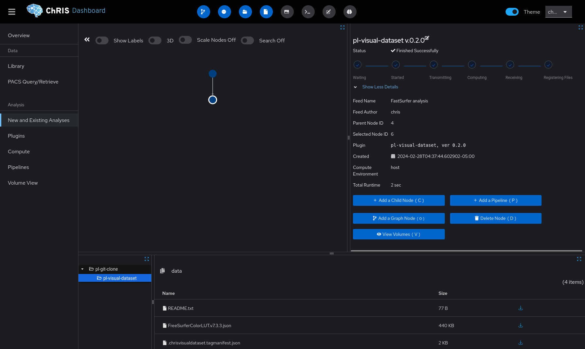
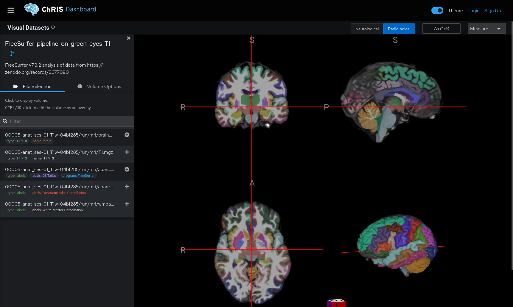
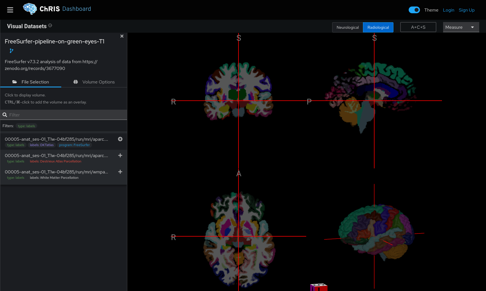
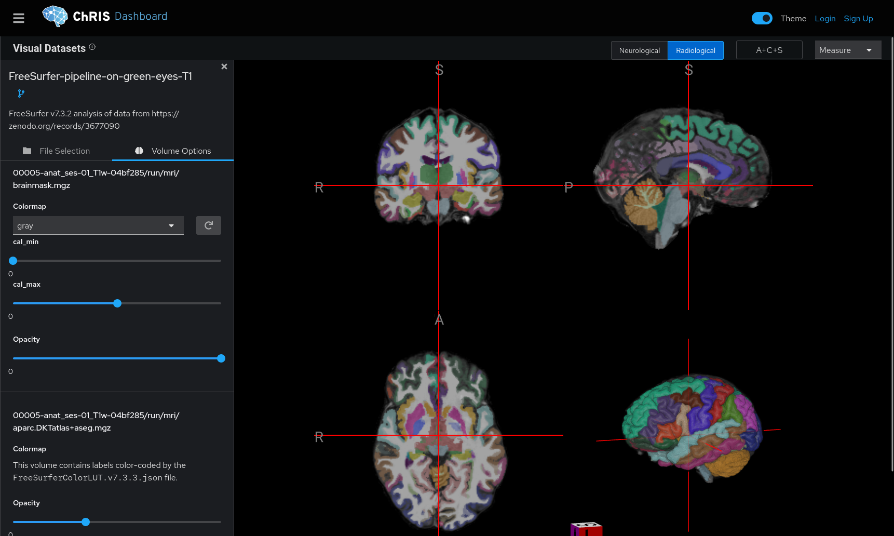

Datasets containing volumetric data can be visualized using the "Visual Datasets" feature
by processing the dataset with the plugin `pl-visual-dataset` as described in the page
["For Dataset Publishers"](./for_dataset_publishers). In the feed view of *ChRIS_ui*, an
additional button appears for `pl-visual-dataset` nodes, labeled "View Volumes".

Clicking the button takes you to "Volume View". You can click the feed icon next to the
feed title in the top-left to go back.

There is a list of files in the sidebar. The files can be filtered by typing in the search bar,
or by clicking on a "tag" to filter by tag.

Click on a file to open it, or <kbd>CTRL</kbd>/&#8984;-click to overlay the file on top of
another selected file. When volume labels are loaded, you can see the name of the label at
the bottom of the screen.

:::tip

Select the T1/T2 MRI volume first, and select the labels last.

:::

With one or more files selected, volume options can be adjusted in the "Volume Options" tab.
Image contrast can be adjusted by `cal_min` and `cal_max` sliders. There is also a slider for `opacity`.

On desktop layouts, additional tools and controls can be found in the top right corner.
For example, select the "Measurement tool" to measure distances.
